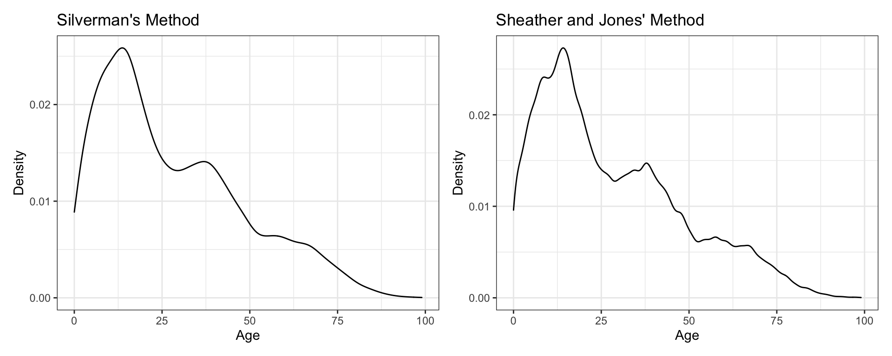
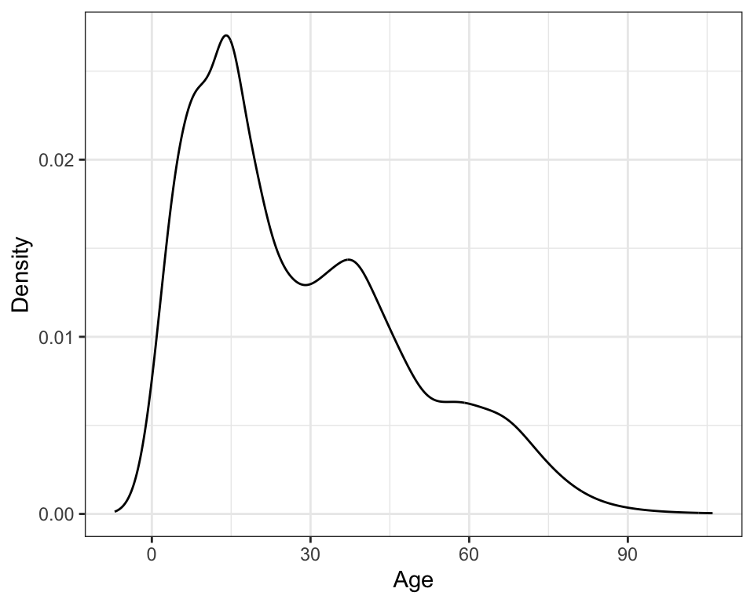

# Kernel Density Estimation {#KDE}

Adapted from @Zieffler:2011


<br /><br />

:::note
This chapter assumes a working knowledge of **dplyr** and **ggplot2** functionality to work with and plot data. 
:::

<br /><br />

In 1986, the Vietnamese government began a policy of *doi moi* (renovation) and decided to move from a centrally planned command economy to a "market economy with socialist direction." As a result, Vietnam was able to evolve from near famine conditions in 1986 to a position as the world's third largest exporter of rice in the mid-1990s. Between 1992 and 1997 Vietnam's gross domestic product (GDP) rose by 8.9\% annually [@worldbank].

The first Vietnam Living Standards Survey (VLSS) was conducted in 1992&ndash;93 by the State Planning Committee (SPC) (now Ministry of Planning and Investment) along with the General Statistical Office (GSO). The second VLSS was conducted by the GSO in 1997&ndash;98. The survey was part of the Living Standards Measurement Study (LSMS) that was conducted in a number of developing countries with technical assistance from the World Bank.

The second VLSS was designed to provide an up-to-date source of data on households to be used in policy design, monitoring of living standards, and evaluation of policies and programs. One part of the evaluation was whether the policies and programs that were currently available were age appropriate for the population. For example, if a country has a higher proportion of older people, then there needs to be programs available that appeal to that sector of the population. Another concern was whether the living standards for different sections of the country were equitable.

Given the background above, data from the second VLSS (available in the [vlss-age.csv](https://raw.githubusercontent.com/zief0002/musings/master/data/vlss-age.csv) data set) is used to examine the following research question:

> What is the age distribution for the Vietnamese population?

To address this research question, we will use kernel density estimation to visually explore the age distribution in the sample data. 


<br /><br />


## Loading Packages and Importing the Data

To begin, we will load two packages that we will use in this analysis.


```r
# Load libraries
library(quantreg)
library(tidyverse)
```

The [vlss-age.csv](https://raw.githubusercontent.com/zief0002/comparing-groups-draft/master/data/vlss-age.csv) data contains the ages of 28,633 individuals (in years ranging from 0 to 99). We will import this data using the `read_csv()` function from the **tidyverse** package^[The `read_csv()` function is technically included in the **readr** package which is included in the **tidyverse** package.]. 


```r
# Import data
vlss = read_csv("https://raw.githubusercontent.com/zief0002/musings/master/data/vlss-age.csv")
head(vlss)
```

```
## # A tibble: 6 x 1
##     age
##   <dbl>
## 1    68
## 2    70
## 3    31
## 4    28
## 5    22
## 6     7
```


<br /><br />


## Nonparametric Density Estimation

Density estimation is one of the most useful methods for examining sample distributions. Nonparametric density estimation is an approach to estimating the distribution of the population from which the sample was drawn. This allows the observed sample data to provide insight into the structure of the unknown probability distribution underlying the population. The density estimation is nonparametric in the sense that the sample data suggest the shape, rather than imposing the shape of a known population distribution with particular values of its parameters. 


<div class="figure" style="text-align: center">

<p class="caption">(\#fig:fig-01)Histogram of the age distribution.</p>
</div>


In the past, it was common for behavioral scientists to use a histogram to estimate the population density. A histogram is one of the simplest nonparametric estimators of a population density. Histograms, usually displayed as a graph, are essentially enumerations, or counts, of the observed data for each of a number of disjoint categories, or bins. Despite the popularity of the histogram, it has a number of drawbacks that suggest it is not always the best method to use. 

The bin width&mdash;which is often chosen by the software rather than the researcher&mdash;has a great deal of influence on the shape of the histogram, and thus, on the inferences made by the researcher. Most methods for creating histograms partition the observed data into equally spaced bins using algorithms that typically focus on producing the optimal bin count given the observed data [@freedman; @scott; @sturges]. These methods often have strong assumptions about the shape of the underlying population distribution. 

For example, when distributions are strongly skewed, the density estimate produced by the histogram may be misleading, since several of the bins chosen in the optimization process can have very little data [e.g., @rissanen]. While there have been methodological advances in selecting the bin width in a histogram [e.g., @wand2], histograms are still essentially modeling the data using discontinuous step functions. These functions assume  gaps in the underlying population density (i.e., a certain discontinuity or discreteness) when the graph of the function jumps to each new *x*-value. So, if the researcher believes that the observed sample data comes from a population with a continuous density, then other estimation methods are preferable. Fortunately, there are substantially better methods of estimating populations with a continuous density.


<br /><br />


## Kernel Density Estimators

A much better estimate of the population density for continuous variables can be obtained by using kernel methods. Nonparametric kernel density estimation can be thought of as a method of averaging and smoothing the density estimate provided by the histogram. More formally, kernel density estimation is a sophisticated form of locally weighted averaging of the sample distribution. 

Kernel density estimation works by estimating the density at each observation, *x*, using a smooth, weighted function, known as a *kernel*. The figure below shows a conceptual illustration of kernel density estimation [adapted from @sain]. The vertical lines below the axis represent the $N=6$ sample observations. The dashed lines represent the Gaussian kernel function, and the solid line represents the overall density estimate. The smoothing parameter, represented by the variation in each distribution, is fixed (i.e., it is the same value in each kernel).

<div class="figure" style="text-align: center">

<p class="caption">(\#fig:unnamed-chunk-3)Illustration of the kernel density estimation (solid line) for *N=6* observations (vertical lines). A Gaussian kernel function (dashed lines) with a fixed smoothing parameter was centered at each observation. The figure was adapted from Sain (1994).</p>
</div>

In the figure, the kernel function is the normal, or Gaussian, distribution.^[There are several kernel functions that can be used in density estimation.] Each kernel function is centered at one of the $N=6$ observations and identically scaled. An estimate of the overall density can then be found by summing the height of all the kernel densities at each observation. 

Note that the variation (width) in the kernel determines the amount of overlap at each observed value. Skinnier kernels have less overlap resulting in a smaller overall sum, while wider kernels would result in more overlap and a larger sum. The data analyst not only specifies the kernel function, but also the variation in the kernel function. The kernel density illustration  shows a visual depiction of the variation in the kernel functions based on the half-width of the kernel (i.e., half the width of each kernel). This is also referred to as the *smoothing parameter* since it has a direct impact on the overall smoothness of the plot.


<br /><br />


## Plotting a Kernel Density Estimate

To plot a kernel density estimate of a distribution, we will use the `geom_density()` function from the **tidyverse** package^[The `geom_density()` function is technically included in the **ggplot2** package, which is included in the **tidyverse** package.]. 


```r
# Create density plot
ggplot(data = vlss, aes(x = age)) +
  geom_density() +
  theme_bw() +
  xlab("Age") +
  ylab("Density")
```

<div class="figure" style="text-align: center">

<p class="caption">(\#fig:fig-02)Kernel density plot of the age distribution using the default (Gaussian) kernel.</p>
</div>

Changing either the kernel function or the smoothing parameter affects the overall density that is estimated. There are several kernel functions that can be used in R. You can change the kernel function by adding the `kernel=` argument to `geom_density()` layer. For example, to use the Epanechnikov kernel, we would add `kernel="epanechnikov"` to the `geom_density()` layer.


```r
# Change kernel function
ggplot(data = vlss, aes(x = age)) +
  geom_density(kernel="epanechnikov") +
  theme_bw() +
  xlab("Age") +
  ylab("Density")
```

<div class="figure" style="text-align: center">

<p class="caption">(\#fig:fig-03)Kernel density plot of the age distribution using the Epanechnikov kernel. Changing the kernel has little effect on the estimation of the density; this plot looks almost identical to the density plot using the Gaussian kernel.</p>
</div>

Changing the kernel function uses a different shaped distribution to estimate the density at each observation. The methodological research literature suggests that the choice of the functional form of the kernel has little effect on the estimation of the density&mdash;all are essentially equivalently efficient in minimizing the error when approximating the true density [e.g., @epanechnikov; @silverman]&mdash;and thus it is reasonable to simply use the default Gaussian kernel function.

Selecting the smoothing parameter is another matter. Change in the amount of variation in the kernel has a large effect on the appearance and interpretation of the density estimate. This is similar to forcing fewer or additional bins in the traditional histogram. The figure below shows the difference in appearance in the overall plot of the kernel density that is associated with changing the smoothing parameter. The three density estimates are based on the same sample of data, and all use the Gaussian kernel function. It can be seen that using a smoothing parameter of 0.5 produces an estimate of the density which is quite rough (left-hand plot), while using a smoothing parameter of 2 (middle plot) produces a smoother estimate. A smoothing parameter of 10 (right-hand plot) produces an even smoother plot. As the smoothing parameter increases, the density curve becomes smoother. 


<div class="figure" style="text-align: center">

<p class="caption">(\#fig:fig-04)Kernel density estimates using three different smoothing parameters. Each estimate used a Gaussian kernel. The estimate on the left used a smoothing parameter of 0.5. The estimate in the middle used a smoothing parameter of 2. The estimate on the right used a smoothing parameter of 10.</p>
</div>


To set the smoothing parameter, we use the `bw=` argument in the `geom_density()` layer of the plot. For example, to set the smoothing parameter to 10, we would use the following syntax:


```r
# Change smoothing parameter
ggplot(data = vlss, aes(x = age)) +
  geom_density(bw = 10) +
  theme_bw() +
  xlab("Age") +
  ylab("Density")
```

If the researcher chooses a smoothing parameter that is too small, the density estimate will appear jagged, spuriously highlighting anomalies of the data such as asymmetry and multiple modes. Such features can appear because of chance variation rather than because they are structures present in the probability distribution. If the researcher chooses a smoothing parameter that is too large, she may obscure much of the structure in the data, a phenomenon known as oversmoothing. Ideally a smoothing parameter is chosen that is small enough to reveal detail in the graph but large enough to inhibit random noise. 

Several methods have been proposed to choose an optimum smoothing parameter based on the data [see @sheather]. While these methods tend to compute smoothing parameters that perform well in simulation studies, for sample data that is substantially nonnormal, some manual adjustment may be required. The method that the `geom_density()` function uses to compute the value of the smoothing parameter is  based on Silverman's rule of thumb [@silverman]. The method popularized by Silverman&mdash;which was originally proposed for improved density estimation in histograms [e.g., @deheuvels; @scott]&mdash;is a computationally simple method for choosing the smoothing parameter. The `geom_density()` function computes the density based on several popular methods:

- Silverman's method (default); `bw="nrd0"`
- Scott's method; `bw="nrd"`
- Sheather and Jones' method; `bw="SJ"`
- Unbiased cross-validation; `bw="ucv"`
- Biased cross-validation; `bw="bcv"`

This actual value of the smoothing parameter can be obtained by employing the `density()` function.


```r
# Obtain smoothing parameter for Silverman's method
d = density(vlss$age, bw = "nrd0")
d
```

```
## 
## Call:
## 	density.default(x = vlss$age, bw = "nrd0")
## 
## Data: vlss$age (28633 obs.);	Bandwidth 'bw' = 2.344
## 
##        x                 y            
##  Min.   : -7.033   Min.   :1.010e-07  
##  1st Qu.: 21.234   1st Qu.:1.410e-03  
##  Median : 49.500   Median :6.416e-03  
##  Mean   : 49.500   Mean   :8.836e-03  
##  3rd Qu.: 77.766   3rd Qu.:1.385e-02  
##  Max.   :106.033   Max.   :2.587e-02
```

For Silverman's method, the default used in the `geom_density()` function, the numerical value of the smoothing parameter for the age variable is 2.344. Although the default smoothing parameter in this case seems reasonable in providing a smooth plot, the prudent data analyst should try several smoothing parameters to ensure that the plot is not oversmoothed. The figure below shows the original plot, as well as additional kernel density plots using the Sheather and Jones method of computing the smoothing parameter. All the methods yield similar curves for the age variable.

<div class="figure" style="text-align: center">

<p class="caption">(\#fig:fig-06)Kernel density estimates using Silverman's rule of thumb for the smoothing parameter (left-hand plot) and Sheather and Jones' method of computing the smoothing parameter, (right-hand plot)</p>
</div>


<br /><br />


## Adaptive Kernel Density Estimation

One promising method for computing the degree of smoothing is the use of *adaptive kernel estimation* [e.g., @bowman; @silverman; @terrell2]. This method seems especially well-suited for estimating densities of long-tailed or multi-modal data. Adaptive kernel density estimation allows the kernels to have differing widths. Varying the smoothing parameter reduces the potential of undersmoothing the density estimate where there are sparse data and also reduces the potential of oversmoothing the density estimate where there are heavy data. 

Adaptive kernel densities can be estimated using the `akj()` function from the **quantreg** package. The `z=` argument takes an equispace sequence of values for which the density should be estimated. From the computations earlier, recall that the density object, `d`, contains a set of equispaced $x$-values at which the density was estimated. These can be accessed using `d\$x`, which is then supplied to the `z=` argument in the `akj()` function. The estimated density is assigned to the object `adapt`. Because of the iterative method that adaptive kernel estimation uses, running the function can take some time depending on the computer's processor and the size of the sample. 


```r
# Create density plot using adaptive kernel density estimation
adapt = akj(x = vlss$age, z = d$x) 
```

To plot this, we first dreate a data frame that includes the *x*-values used in the `z=` argument and the density estimates, stored in `adapt$dens`. Then we can use `geom_line()` to plot the actual density estimates.


```r
# Set up data frame
density_est = data.frame(
  x = d$x,
  y = adapt$dens
)

# Plot density estimates
ggplot(data = density_est, aes(x = x, y = y)) +
  geom_line() +
  theme_bw() +
  xlab("Age") +
  ylab("Density")
```

<div class="figure" style="text-align: center">

<p class="caption">(\#fig:fig-07)Density plot using adaptive kernel density estimation.</p>
</div>


<br /><br />


## Density Estimation in Practice

Unfortunately, there is no one uniform best method for choosing the smoothing parameter [@simonoff]. @terrell [p. 470] asserts that "most density estimates are presumably designed on aesthetic grounds: The practitioner picks the smoothing parameter so that the density looks good. Clearly, though, such an individualistic approach does not lead to replicable results; nor does it lead reliably to sensible estimates from a novice."

While researchers may make different analytic decisions about the choice of kernel and smoothing parameters, hopefully, the substantive findings about the research questions will not change (although it is possible that they may). For example, in all three methods of smoothing preseneted, the estimated kernel density shows that the population has three potential modes in the distribution. These likely refer to three distinct age groups or subpopulations. Each of these age groups has a higher density (taller distribution) and seems to have less variation (a thinner distribution) than the subsequent younger age group.

Regardless of the analytic decisions made, any statistical results presented need to include sufficient information included to judge the soundness of the conclusions drawn. This helps the researcher either verify or call into question what she is seeing from the analysis. There are two things to keep in mind:

- There is no "right" answer in statistical analysis [@box; @box2] but only explanation and presentation.
- There is a distinction between how most researchers do their analysis and how they present their results.

When presenting results, researchers should integrate or synthesize information from the data analysis with the content and findings from the substantive literature. Relating the findings back to previous research helps the researcher evaluate her findings. The results might verify other findings or question them. The researcher might also question her own results if they are not consistent with expectations and other studies. Remember, the statistical analysis is used to inform the substantive area, and the writing should reflect this. An example of a write-up for the age distribution analysis might be as follows.

> The density for a sample of ages from $N=28,633$ Vietnamese citizens was estimated using an adaptive kernel method [@portnoy]. The plot of the estimated kernel density reveals three potential subpopulations in the distribution which depict three distinct age groups: a younger, middle-aged, and older generation. The population pyramid based on the 1999 Vietnam census also seems to indicate the presence of three subpopulations [@gso]. The overall positive skew in the distribution also suggests that the population of each subsequently higher age group has relatively lower frequency. Two other interesting features emerge in the density plot that have also been documented in the research literature [e.g., @haughton]. The second mode in the age distribution occurs near the age of 40. This mode has lower frequency in part because of lives lost during the Vietnam War, which ended in 1975 with the reunification of North and South Vietnam. One can also see the effect of decreasing fertility rates in the fact that estimated density decreases as ages decrease from about 16 to zero.

<br /><br />


<!-- ## Extension: Uncertainty Envelope for Kernel Densities -->

<!-- One concern that is raised by using the density estimate in exploring univariate data is the need to evaluate which features of the density estimate indicate legitimate underlying structure and which can be attributable to random variation. For example, does the distribution of age  actually contain three modes? Or, in particular, is the third mode attributable to chance variation produced by poor estimation of the density at those age values? One method of capturing the uncertainty associated with a density estimate is to create a *uncertainty envelope* or *variability bands* around the density estimate. @wand argue that the graphical display of the uncertainty can be helpful when determining if interesting features of the density are indeed part of the underlying structure in the population. -->

<!-- As demonstrated by @bowman, the boundaries for the uncertainty envelope around the density estimate can be computed in a point-wise manner as: -->

<!-- $$ -->
<!-- \hat{p}(x) \pm 2 \times \mathrm{SE}_{\hat{p}(x)}, -->
<!-- $$ -->

<!-- where $\hat{p}(x)$ is the density estimate at some value $x$, and $\mathrm{SE}_{\hat{p}(x)}$ is the standard error computed from the variance estimate, which in turn is computed using a Taylor series approximation. @bowman have implemented functionality to compute and plot the density estimate along with variability bands in R, using the `stat_density_confidence()` function from the **educate** package.^[The **educate** package is not currently on CRAN. It can be installed from github using `remotes::install_github("zief0002/educate")`.] The syntax below shows how we plot the uncertainty envelope and kernel density estimate for the distribution of ages. (Here we select a sample of 100 ages to better illustrate the uncertainty envelope.) -->

<!-- ```{r fig-08, echo=FALSE, message=FALSE, fig.cap="Kernel density estimate (solid line) with uncertainty envelope (light blue shaded area) for the distribution of 1,000 ages sampled from the VLSS data."} -->
<!-- # Load educate package -->
<!-- library(educate) -->

<!-- # Set random number generation state for reproducibility -->
<!-- set.seed(42) -->

<!-- # Sample 1,000 ages -->
<!-- vlss_samp = vlss %>% -->
<!--   sample_n(1000) -->

<!-- # Plot uncertainty envelope and density estimate -->
<!-- ggplot(data = vlss_samp, aes(x = age)) + -->
<!--   stat_density_confidence(h = 4.61) + -->
<!--   geom_density() + -->
<!--   theme_bw() + -->
<!--   xlab("Age") + -->
<!--   ylab("Density") -->
<!-- ``` -->


<!-- For example, almost all of the troughs and peaks of the small wiggles in the density estimate (black line) in Figure \@ref(fig:fig-08) can be smoothed out and remain within the boundaries of the uncertainty envelope. This implies that those particular troughs and peaks are likely just due to random noise in the sample data, and probably do not exist in the population. On the other hand, the different plateau near ages 35 and 70 are clearly distinct. -->


## Further Reading

This section provides some references for the reader interested in building on the material presented in this chapter. While this list is not complete, it does offer some starting points. The philosophies underlying exploratory data analysis were introduced by Tukey [-@tukey; -@tukey2]. Many other statisticians have written papers building on and implementing Tukey's initial ideas including @cleveland2, @dasu, and @leinhardt. Regarding the ideas and methods related to density estimation, the interested reader is referred to @bowman, @sheather, and @wilcox2. Overviews and surveys of the methods used to select a smoothing parameter are offered in @turlach and @jones. 

<!-- For further guidance on presenting results, resources include @aera, @apa2}, and @cummins. -->


<br /><br />


<!-- FIX MATH -->
<script type="text/x-mathjax-config">
  MathJax.Hub.Config({ CommonHTML: { scale: 180 } });
</script>


