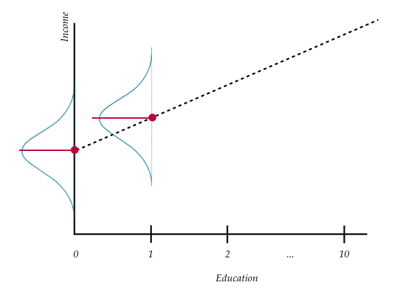

# Simple Linear Regression---Description {#slrd}


In this set of notes, you will begin your foray into regression analysis. To do so, we will use the [riverview.csv](https://raw.githubusercontent.com/zief0002/modeling/master/data/riverview.csv) data to examine **whether education level is related to income**. The data contain five attributes collected from a random sample of $n=32$ employees working for the city of Riverview, a hypothetical midwestern city (see the [data codebook](http://zief0002.github.io/epsy-8251/codebooks/riverview.html)). To begin, we will load several libraries and import the data into an object called `city`.


```r
# Load libraries
library(dplyr)
library(ggplot2)
library(readr)

# Read in data
city = read_csv(file = "https://raw.githubusercontent.com/zief0002/modeling/master/data/riverview.csv")
head(city)
```

```
# A tibble: 6 x 5
  education income seniority gender     party      
      <dbl>  <dbl>     <dbl> <chr>      <chr>      
1         8   26.4         9 female     Independent
2         8   37.4         7 Not female Democrat   
3        10   34.2        16 female     Independent
4        10   25.5         1 female     Republican 
5        10   47.0        14 Not female Democrat   
6        12   46.5        11 female     Democrat   
```

<br />


## Data Exploration

Any analysis should start with an initial exploration of the data. During this exploration, you should examine each of the variables that you will be including in the regression analysis. This will help you understand results you get in later analyses, and will also help foreshadow potential problems with the analysis. [This blog post](https://www.analyticsvidhya.com/blog/2016/01/guide-data-exploration/) describes initial ideas of data exploration reasonably well. You could also refer to almost any introductory statistics text for additional detail. 

It is typical to begin by exploring the distribution of each variable used in the analysis separately. These distributions are referred to as *marginal distributions*. After that, it is appropriate to explore the relationships between the variables. 

<br />


### Marginal Distribution of Income

To begin this exploration, we will examine the marginal distribution of employee incomes. We can plot a marginal distribution using functionality from the **ggplot2** package.


```r
ggplot(data = city, aes(x = income)) +
  stat_density(geom = "line") +
  theme_bw() +
  xlab("Income (in thousands of dollars)") +
  ylab("Probability density")
```

<div class="figure" style="text-align: center">

<p class="caption">(\#fig:unnamed-chunk-3)Density plot of employee incomes.</p>
</div>

This plot suggests that the distribution of employee incomes is unimodal and most of the incomes are between roughly \$50,000 and \$70,000. The smallest income in the sample is about \$25,000 and the largest income is over \$80,000. This indicates there is a fair amount of variation in the data.

To further summarize the distribution, it is typical to compute and report summary statistics such as the mean and standard deviation. One way to compute these values is to use functions from the **dplyr** library.


```r
city %>%
  summarize(
    M = mean(income),
    SD = sd(income)
    )
```

```
# A tibble: 1 x 2
      M    SD
  <dbl> <dbl>
1  53.7  14.6
```


Describing this variable we might write,


> The marginal distribution of income is unimodal with a mean of approximately \$53,700. There is variation in employees' salaries (SD = \$14,500).

<br />


### Marginal Distribution of Education Level

We will also examine the marginal distribution of the education level variable.


```r
# Plot
ggplot(data = city, aes(x = education)) +
  stat_density(geom = "line") +
  theme_bw() +
  xlab("Education level") +
  ylab("Probability density")
```

<div class="figure" style="text-align: center">

<p class="caption">(\#fig:unnamed-chunk-5)Density plot of employee education levels.</p>
</div>


```r
# Summary statistics
city %>%
  summarize(
    M = mean(education),
    SD = sd(education)
    )
```

```
# A tibble: 1 x 2
      M    SD
  <dbl> <dbl>
1    16  4.36
```


Again, we might write,

> The marginal distribution of education is unimodal with a mean of 16 years. There is variation in employees' level of education (SD = 4.4).

<br />


### Relationship Between Variables

Although examining the marginal distributions is an important first step, those descriptions do not help us directly answer our research question. To better understand any relationship between income and education level we need to explore how the distribution of income differs as a function of education. To do this, we will create a scatterplot of incomes versus education.


```r
ggplot(data = city, aes(x = education, y = income)) +
  geom_point() +
  theme_bw() +
  xlab("Education (in years)") +
  ylab("Income (in U.S. dollars)")
```

<div class="figure" style="text-align: center">

<p class="caption">(\#fig:unnamed-chunk-7)Scatterplot displaying the relationship between employee education levels and incomes.</p>
</div>

The plot suggests a relationship (at least for these employees) between level of education and income. When describing the relationship we want to touch on four characteristics of the relationship:

- Functional form of the relationship
- Direction
- Strength
- Observations that do not fit the trend (outliers)

<br />


## Statistical Model: Mathematical Description of the Data

Since the relationship's functional form seems reasonably linear, we will use a *linear model* to describe the data. We can express this model mathematically as,

$$
Y_i = \beta_0 + \beta_1(X_i) + \epsilon_i
$$

In this equation,

- $Y_i$ is the outcome/response value; it has an $i$ subscript because it can vary across cases/individuals.
- $\beta_0$ is the intercept of the line that best fits the data; it does not vary across individuals.
- $\beta_1$ is the slope of the line that best fits the data; it does not vary across individuals.
- $X_i$ is the predictor value; it has an $i$ subscript because it can vary across cases/individuals.
- $\epsilon_i$ is the error term; it has an $i$ subscript because it can vary across cases/individuals.

The linear statistical model (i.e., the regression model) can be separated into two components: a *systematic* (or fixed) component and a *random* (or stochastic) component.

$$
Y_i = \underbrace{\beta_0 + \beta_1(X_i)}_{\substack{\text{Systematic} \\ \text{(Fixed)}}} + \underbrace{\epsilon_i}_{\substack{\text{Random} \\ \text{(Stochastic)}}}
$$

<br />

### Systematic Part of the Statistical Model

The systematic (fixed) part of the equation gives the mean value of $Y$ given a particular $X$-value. The mean of $Y$ given a particular $X$-value is referred to as a *conditional mean* of $Y$. The notation for the conditional mean of $Y$ given a particular $X$ value is $\mu_{Y \vert X_i}$. We express the systematic part of the linear regression model mathematically as,

$$
\mu_{Y \vert X_i} = \beta_0 + \beta_1(X_i)
$$

Note that the systematic part of the equation does not include the error term. The error term is a part of the random component of the model. Statisticians also use $\hat{Y_i}$ to indicate the conditional mean of $Y$ at a particular $X$. Thus, the systematic part of the linear regression model can also be written as,

$$
\hat{Y_i} = \beta_0 + \beta_1(X_i)
$$

The terms $\beta_0$ and $\beta_1$ in the systematic part of the model are referred to as the *regression parameters*. One of the primary goals of a regression analysis is to estimate the values of the regression parameters (i.e., the intercept and slope terms). Thus the systematic part of the regression model is a description, in mathematical form, of how the conditional mean $Y$ is related to $X$. The equation here indicates that the conditional mean of $Y$ ($\hat{Y_i}$) is a linear function of $X$. This implies that *the conditional mean value of $Y$ differs by a constant amount for a constant difference in $X$*. 

For example, the difference between the mean income for those employees who have 10 years of education and those that have 11 years of education *is the same as* the difference between the mean income for those employees who have 17 years of education and those that have 18 years of education. Or, the difference between the mean income for those employees who have 4 years of education and those that have 8 years of education *is the same as* the difference between the mean income for those employees who have 20 years of education and those that have 24 years of education.

<br />


### Visual Representation of the Regression Model

To help better understand the model, consider the following plot:

<div class="figure" style="text-align: center">

<p class="caption">(\#fig:unnamed-chunk-8)Plot displaying conditional distribution of $Y$ at several $X$ values. The OLS fitted regression line (dotted) is also shown. The red points show the mean value of $Y$ for each conditional distribution.</p>
</div>

At each value of $X$ there is a distribution of $Y$. For example, there would be a distribution of incomes for the employees with an education level of 10 years (in the population). There would be another distribution of incomes for the employees with an education level of 11 years (in the population). And so on. These are the conditional distributions of $Y$.

Each conditional distribution of $Y$ has a mean; the conditional mean or $\hat{Y_i}$. These conditional means are can be connected using a line. This is what it means to be able to express the conditional mean of $Y$ as a linear function of $X$, or to say that the relationship between $X$ and $Y$ is linear. 

<br />


### Random Part of the Statistical Model

From the visual representation of the model, we can see that there is a distribution of $Y$-values at each $X$-value; this is represented by the normal distributions in the picture. In our example, there are many employees who have the same education level, but have different incomes. The error term in the statistical model accounts for this variation in $Y$ for those cases that have the same $X$-value. Mathematically we can understand this by re-writing the statistical model, substituting $\mu_{Y \vert X_i}$ in to the systematic part of the model.

$$
\begin{split}
Y_i &= \beta_0 + \beta_1(X_i) + \epsilon_i \\
Y_i &= \mu_{Y \vert X_i} + \epsilon_i
\end{split}
$$

This equation implies that each observed $Y$-value is the sum of the conditional mean value of $Y$ (which is based on the $X$-value) and some *residual* (or error) term. Re-arranging the terms, we can mathematically express the residual term as,

$$
\epsilon_i = Y_i - \mu_{Y \vert X_i}
$$

Or, using the $\hat{Y_i}$ notation,

$$
\epsilon_i = Y_i - \hat{Y_i}
$$

To compute an observation's residual, we compute the difference between the observation's $Y$-value and its conditional mean value. When the observed value of $Y$ is larger than the conditional mean value of $Y$ the residual term will be positive (underprediction). If the observed value of $Y$ is smaller than the conditional mean value of $Y$ the residual term will be negative (overprediction).

To further understand the residual term, consider the plot below. This figure shows the relationship between education and income we plotted earlier, and also includes the regression line.

<div class="figure" style="text-align: center">

<p class="caption">(\#fig:unnamed-chunk-9)Scatterplot displaying the relationship between employee education levels and incomes. The OLS fitted regression line is also displayed.</p>
</div>

Consider the three employees that have an education level of 10 years. The conditional mean income for these three employees is approximately \$37,800. This is denoted by the blue point. Remember, the conditional means are on the regression line. The error (residual) term allows for discrepancy between the conditional mean of $Y$ and the observed $Y$. In other words, none of these three employees have an actual income of \$37,800. The residual represents the difference between the employee's observed income and the conditional mean income based on their education level.

Graphically, the residual is represented by the vertical distance between the line and a given point on the scatterplot. Some of those points are above the line (they have a positive residual) and some are below the line (they have a negative residual). Also note that for some observations the error term is smaller than for others.

<br />


## Estimating Parameters in the Regression Model

The regression model describes the relationship between $Y$-values and $X$-values in the *population*. Every term in the model denoted using a Greek letter is an unknown *parameter* in this model. In the model we have written there are three unknown parameters denoted in the model: the intercept term ($\beta_0$), the slope term ($\beta_1$), and the residual term ($\epsilon_i$).^[Technically there are many unknown residuals, one for each case, but the assumptions we put on the linear model make it so that we only care about the variance of the residuals, hence a single unknown.]

In most statistical analyses, you will use a *sample* of data (not the entire population) to estimate the parameter values. Because a sample is only a subset of the population, the values we obtain for the parameters are imperfect estimates. To denote that the parameters are sample-based estimates, we add a hat to each parameter we are estimating. For example, estimates of the parameter estimates of $\hat\beta_0$ and $\hat\beta_1$ (referred to as *regression coefficients*) are typically reported in a regression analysis and should include hats.

Applied researchers and statisticians tend to focus their analysis on the systematic (fixed) part of the model, and are thus often most interested in the values of the regression coefficients. *After fitting the model to data*, the estimated conditional means can be expressed mathematically as:

$$
\hat\mu_{Y \vert X_i} = \hat\beta_0 + \hat\beta_1(X_i)
$$

Or, using the notation $\hat{Y}_i$ rather than $\hat\mu_{Y \vert X_i}$, as:

$$
\hat{Y_i} = \hat\beta_0 + \hat\beta_1(X_i)
$$

We use the hats when we are indicating sample-based estimates of these values, so hats should be used when you are reporting the values obtained *after* using a sample of data to obtain the values.^[Sometimes people use Roman letters when referring to sample estimates rather than hatting the Greek letters. For example, the sample-based equation might be denoted: $\hat{Y}_i = b_0 + b_1(X_i) + e_i$.] The two estimated parameters of interest here ($\hat\beta_0$ and $\hat\beta_1$) are referred to as the *estimated regression coefficients*, and this equation is often referred to as the *fitted regression equation*, or simply the *fitted equation*.

<br />


<!-- $$ -->
<!-- Y_i = \hat\beta_0 + \hat\beta_1(X_i) + \hat\epsilon_i -->
<!-- $$ -->

<!--  -->
<!--  This is called the *fitted regression model* since it is obtained after fitting the regression model to a sample of data.  -->


<br />


### Estimating Residuals

Note that we can also use the estimated regression coefficients to obtain estimates for the residuals, often referred to as the *observed residuals*. Here we make use of the earlier idea that the residual term was the difference between the observed value of $Y$ and the conditional mean of $Y$ for a given $X$-value. Mathematically, 

$$
\epsilon_i = Y_i - \mu_{Y \vert X_i}
$$

Once we use data to obtain estimates for the intercept and slope ($\hat\beta_0$ and $\hat\beta_1$) we can substitute those into the fitted equation and obtain an estimate for the conditional mean ($\hat{\mu}_{Y \vert X_i}$). This value can then be used to obtain an estimate for the residual.

$$
\hat\epsilon_i = Y_i - \hat{\mu}_{Y \vert X_i}
$$

Or, using the "Y-hat" notation,

$$
\hat\epsilon_i = Y_i - \hat{Y_i}
$$

Remember, the hat on the residual indicates it is an estimate based on values obtained from the data!

<br />


## Fitting a Regression Model to Data Using R

To fit the regression model to data using R, we will use the `lm()` function. The syntax for this function looks like this:

> `lm(`**outcome** ~ `1 + ` **predictor**, `data =` **dataframe**`)`

where **outcome** is the name of the outcome/response variable, **predictor** is the name of the predictor variable, and **dataframe** is the name of the data frame. (The `1` on the right side of the tilde tells R to include the intercept in its computation.) When we fit a regression model in R, we will also assign the output to a new object in R. Below, we fit the model using education level to predict income. Here the output is assigned to an object called `lm.a`. We can print the regression parameter estimates by typing the `lm()` object name and hitting enter.


```r
# Fit regression model
lm.a = lm(income ~ 1 + education, data = city)

# Print regression coefficients
lm.a
```

```

Call:
lm(formula = income ~ 1 + education, data = city)

Coefficients:
(Intercept)    education  
     11.321        2.651  
```

Here the parameter estimates (or regression coefficients) are:

- $\hat{\beta}_0 = 11.321$
- $\hat{\beta}_1 = 2.651$

Remember that these are estimates and need the hats. The systematic part of the fitted regression model (or *fitted equation*) is:

$$
\hat{\mathrm{Income}_i} = 11.321 + 2.651(\mathrm{Education~Level}_i)
$$

<br />


### Intercept Interpretation

The estimate for the intercept was 11.321. Graphically, this value indicates the value where the line passes through the $y$-axis (i.e., $y$-intercept). As such, it gives the $\hat{Y}_i$ or predicted value when $X = 0$. Algebraically we get the same thing if we substitute 0 in for $X_i$ in the fitted regression equation.

$$
\begin{split}
\hat{Y}_i &= \hat{\beta}_0 + \hat{\beta}_1(0) \\
\hat{Y}_i &= \hat{\beta}_0
\end{split}
$$


To interpret this value, remember that $\hat{Y}_i$ is a conditional mean. In this case, it represents the model predicted mean income for all employees that have an education level of 0 years. Graphically this looks like the following.

<div class="figure" style="text-align: center">

<p class="caption">(\#fig:unnamed-chunk-11)Plot displaying conditional distribution of $Y$ at $X=0$. The OLS fitted regression line (dotted) is also shown. The red points show the mean value of $Y$ for this conditional distribution---which corresponfds to the intercept value of the regression line.</p>
</div>

Interpreting the intercept coefficient from our example,

> The model predicted mean income for all employees that have an education level of 0 years is \$11,321.

<br />


### Slope Interpretation

Recall from algebra that the slope of a line describes the change in $Y$ versus the change in $X$. In regression, the slope describes the *predicted* change in $\hat{Y}$ for a one-unit difference in $X$. In our example,

$$
\hat{\beta}_1 = \frac{\Delta\hat{Y}}{\Delta X} = \frac{2.651}{1}
$$


Again, because $\hat{Y}$ is a conditional mean, the slope represents the difference in predicted mean incomes for each one-year difference in education level. Graphically,

<div class="figure" style="text-align: center">

<p class="caption">(\#fig:unnamed-chunk-12)Plot displaying conditional distribution of $Y$ at $X=0$ and $X=1$. The OLS fitted regression line (dotted) is also shown. The red points show the mean value of $Y$ for these conditional distributions---the relative change which corresponds to the slope value of the regression line.</p>
</div>

Interpreting the slope coefficient in our example,


> Each one-year difference in education level is associated with a model predicted difference of \$2,651 in mean income.


To better understand this, consider the mean income for city employees with three different education levels. The first set of employees have an education level of 10 years. The second set have an education level of 11 years, and the third set have an education level of 12 years. Now let's compute each set of employees' mean income using the estimated regression coefficients.

$$
\begin{split}
\mathbf{Education=10:~}\hat{\mathrm{Income}} &= 11.321 + 2.651(10) \\
&= 37.831
\end{split}
$$


$$
\begin{split}
\mathbf{Education=11:~}\hat{\mathrm{Income}} &= 11.321 + 2.651(11) \\
&= 40.482
\end{split}
$$


$$
\begin{split}
\mathbf{Education=12:~}\hat{\mathrm{Income}} &= 11.321 + 2.651(12) \\
&= 43.133
\end{split}
$$

Each set of employees' education levels differ by one year (10 to 11 to 12). The difference in predicted mean incomes for these employees differs by 2.651 thousand dollars.

<br />

### Estimating Residuals

Consider the 25th case in the data frame.


```r
city %>%
  filter(row_number() == 25)
```

```
# A tibble: 1 x 5
  education income seniority gender party      
      <dbl>  <dbl>     <dbl> <chr>  <chr>      
1        20   54.7        12 female Independent
```

This employee (Employee 25) has an education level of 20 years ($X_{25}=20$). Her income is 54.672 thousand dollars ($Y_{25}=54.672$). Using the fitted regression equation, we can compute the model predicted mean income for employees with 20 years of education as,


```r
# Y_hat = b0 + b1 * X
11.321 + 2.651 * 20
```

```
[1] 64.341
```

$$
\hat{Y}_{25} = 64.341
$$

We could also report this using the conditional mean notation,

$$
\hat\mu_{Y \vert X=20} = 64.341
$$

Now we can use the estimated conditional mean to also compute Employee 25's residual.


```r
# e = Y - Y_hat
54.672 - 64.341
```

```
[1] -9.669
```

Using mathematical notation,

$$
\hat\epsilon_{25} = -9.669
$$


The negative residual, $\hat\epsilon_{25} = -9.669$, suggests that this employee earns \$9,669 less than the average predicted income for employees with 20 years of education. We can also represent these values graphically.

<div class="figure" style="text-align: center">

<p class="caption">(\#fig:unnamed-chunk-16)Plot displaying the OLS fitted regression line (blue) between employee education levels and incomes. The 25th employee's observed data (black dot) is plotted, and a visual representation of the employee's residual (red line) is also displayed.</p>
</div>


<br />

## Answering the Research Question

Remember that this whole analysis was driven because we wanted to answer a question, namely whether education level is related to income for the Riverview employees. The results from the regression analysis allows us to answer this question.

> To answer the question of whether education level is related to income, a linear regression model was fitted to the data using ordinary least squares estimation. The results of this analysis suggested that education level is positively related to income for the 32 employees ($\hat\beta_1 = 2.65$). Each year of education is associated with a \$2,651 difference in income, on average.


Here the regression analysis provides a quantitative summary of the relationship between education level and income. It provides us information about the direction of the relationship (positive) and the magnitude of that relationship. Although this can give us a description of the realtionship, it is only for the sample of data you looked at (i.e., for these 32 employees). To make further statements about whether there is a relationship between education level and income in a broader popualtion (e.g., all Riverview employees, or all California residents), we need more information, namely [whether the sample is representative of the larger population](https://www.ncbi.nlm.nih.gov/pmc/articles/PMC3105563/) and also statistical information about the amount of sampling error we have. (We will cover sampling error in Chapter 5.)


