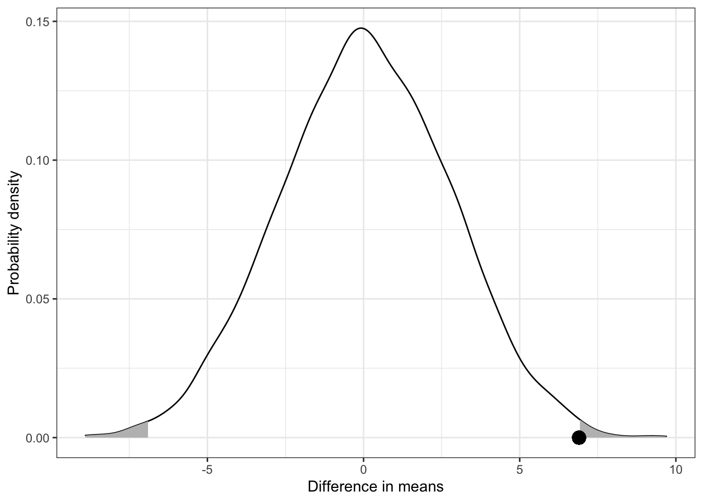

# Randomization and Permutation Tests {#randomization-tests}

Adapted from @Zieffler:2011


<br /><br />

:::note
This chapter assumes a working knowledge of **dplyr** and **ggplot2** functionality to work with and plot data. 
:::

<br /><br />

In the chapter [Exploration: Comparing Two Groups](#exploration), differences between two groups were examined. Specifically, the question of whether there were differences in the annual household per capita expenditures between the rural and urban populations in Vietnam was addressed. In that chapter, exploratory methods, such as graphical and numerical summarizations, were used to quantify the differences in the two distributions of household per capita expenditures. Exploration is often only the starting point for examining research questions involving group differences. 

These methods do not always provide a complete answer to the research question. For example, most educational and behavioral researchers also want to determine whether the differences that might have shown up in the exploration phase are "real," and to what population(s) the "real" effect can be attributed. A "real" effect is a sample effect that is caused by an actual difference in the population of interest. For example, suppose the mean per capita household expenditures for the entirety of Vietnam is actually less for rural regions. Then a sample result would be expected to reflect this, provided the sample was obtained in a particular way, namely, randomly (see below). In addition to evaluating whether effects are "real", it is important to estimate the size of the effect. Uncertainty is always involved in this endeavor, which relates to the *precision* of the estimate.

Questions of whether or not group differences are "real", estimates of the size of group differences, and the precision of these estimates are typically problems of *statistical inference*. First, however, two research questions regarding group differences that have been studied by educational and behavioral scientists are presented.

<br /><br />

### Research Question 1

Demands for accountability and delinquency prevention in recent years have led to rising popularity of after-school programs in the United States. The intuitive appeal of these programs is based on the perception that adolescents left unsupervised will either  simply waste time or, worse, engage in delinquent and dangerous behaviors. 

To empirically study the effects of attending an after-school program, @gottfredson randomly assigned middle-school students to either a treatment group or control group. The treatment consisted of participation in an after-school program, whereas the control group engaged in their usual routine, but control students were invited to attend one after-school activity per month. Data on several outcome measures were collected on the study participants. These data are available in [after-school.csv](https://raw.githubusercontent.com/zief0002/musings/master/data/after-school.csv). The researchers were interested in determining whether there is a difference in the effect of delinquency between students who participated in the after-school program and students that did not.

<br /><br />


### Research Question 2

The Center for Immigration Studies  at the United States Census Bureau has reported that despite shifts in the ethnic makeup of the immigrant population, Latin America---and Mexico specifically---remains this country's greatest source of immigrants. Although the average immigrant is approximately 40 years old, large numbers are children who enroll in U.S. schools upon arrival. Their subsequent educational achievement affects not only their own economic prospects but also those of their families, communities, and the nation as a whole.

@stamps studied the educational achievement of Latino immigrants by examining a random sample of the  2000 decennial Census data, a subset of which is provided in [latino-education.csv](https://raw.githubusercontent.com/zief0002/musings/master/data/latino-education.csv). One interesting research question that has emerged from their research is whether there is a link between where the immigrants originated and their subsequent educational achievement. Specifically, the question is if there is a difference in the educational achievement of immigrants from Mexico and that of immigrants from other Latin American countries. 

<br /><br />


### Random Assignment &amp; Random Sampling

While both of these research questions may seem similar---apart from their context---they are in fact very different. In the first situation, the researchers used a volunteer sample and randomly assigned the participants in their sample to the two groups---treatment and control. In the second situation, the researchers randomly selected their sample from a larger population (the 2000 census), but the two groups were not assigned by the researchers. These examples illustrate two important differences: (1) how the sample is selected and (2) how the treatments, or groups, are assigned. Table \@ref(tab:tab-01) shows the four potential situations that educational and behavioral science researchers could face.


<table style="width:70%; margin-left: auto; margin-right: auto;" class="table">
<caption>(\#tab:tab-01)Four Potential Scenarios Researcher Could Face When Making Inferences</caption>
 <thead>
  <tr>
   <th style="text-align:left;text-align: center;"> Scenario </th>
   <th style="text-align:center;text-align: center;"> RS$^a$ </th>
   <th style="text-align:center;text-align: center;"> RA$^b$ </th>
   <th style="text-align:left;text-align: center;"> Type of Research </th>
  </tr>
 </thead>
<tbody>
  <tr>
   <td style="text-align:left;"> Scenario 1 </td>
   <td style="text-align:center;"> ✓ </td>
   <td style="text-align:center;">  </td>
   <td style="text-align:left;"> Generalizable research </td>
  </tr>
  <tr>
   <td style="text-align:left;"> Scenario 2 </td>
   <td style="text-align:center;">  </td>
   <td style="text-align:center;"> ✓ </td>
   <td style="text-align:left;"> Randomized, experimental research </td>
  </tr>
  <tr>
   <td style="text-align:left;"> Scenario 3 </td>
   <td style="text-align:center;"> ✓ </td>
   <td style="text-align:center;"> ✓ </td>
   <td style="text-align:left;"> Generalizable, randomized, experimental research </td>
  </tr>
  <tr>
   <td style="text-align:left;"> Scenario 4 </td>
   <td style="text-align:center;">  </td>
   <td style="text-align:center;">  </td>
   <td style="text-align:left;"> Nongeneralizable, nonexperimental research </td>
  </tr>
</tbody>
<tfoot>
<tr><td style="padding: 0; border: 0;" colspan="100%">
<sup>a</sup> RS = Random sample</td></tr>
<tr><td style="padding: 0; border: 0;" colspan="100%">
<sup>b</sup> RA = Random assignment</td></tr>
</tfoot>
</table>

Each of these scenarios impacts the conclusions that a researcher can draw from quantitative results. How the sample is selected has a direct impact on the generalizations that a researcher can draw. For  example, random sampling helps ensure that the conclusions drawn from the sample data can be generalized to the population from which the sample was drawn. In contrast, how the treatments are assigned has a direct impact on the causal inferences a researcher can make. Random assignment to treatments facilitate these causal inferences by allowing the attribution of sample differences to the differences in treatments.

The nomenclature used in Table \@ref(tab:tab-01) is employed in this monograph to help educational and behavioral researchers make clearer distinctions between these scenarios. Unfortunately, the discipline of statistics uses no consistent terminology to describe each of these scenarios. For example, in research that employ random assignment, the term "experiment" is sometimes used, but as @kempthorne4 [p. 124] points out:

<p class="actualquote">
The literature of statistics has been plagued with difficulties about the use of the word "experiment." Interestingly enough, so also has the general world of science. The problem is that a loose use of the word "experiment" permits it to be applied to any process of examination of a space-time section of the world.
</p>

The use of random sampling and/or random assignment are the components that allow statistical inference to take place. The mathematical theory for inferential methods is, in fact, intrinsically tied to the employment of one or both of these random mechanisms. In this chapter, methods that allow researchers to answer research questions in which the researcher has randomly assigned the treatments are examined. In the chapter [Bootstrap Tests](#bootstrp-tests), methods that allow researchers to answer research questions if the study used random sampling to select the sample are examined. The other two scenarios---generalizable, randomized experimental research and nongeneralizable research---are touched on in this chapter and the [Bootstrap Tests](#bootstrp-tests) chapters and are discussed further in the [Philosophical Considerations](#philosophical-considerations) chapter.

<br /><br />


## Randomized Experimental Research

Consider researchers who are studying whether after-school programs have an effect on delinquency. What if they observed that students who participate in after-school programs tended to have a low measure of delinquency? What could be said about the effect of after-school programs on delinquency? Should the researchers conclude that after-school programs lessen delinquency for students? That, of course, is one explanation for the observed relationship. However, there are several alternative explanations as well. One rival explanation is that students with a low propensity for delinquency to begin with were the ones who participated in the after-school program. And, had these students not participated in the after-school program, they still would have had low measures of delinquency. Because there is no comparison group---no variation in the treatment predictor---there is no way to establish which explanation is correct.

When examining the effect of a treatment or intervention, it is essential that educational and behavioral researchers specify a comparison group---often referred to as a *control group*. The comparison group attempts to answer the question, what would have happened to the group of students if they did not receive the treatment? Without a comparison group, it is impossible to rule out alternative explanations for the "effect" that is being examined. In fact, because the conclusions drawn from research that is conducted without comparison groups are relatively weak, many experts suggest that such research is a waste of time and "at best, offer indecisive answers to the research questions, and, at worst, might lead to erroneous conclusions" [@light, pp. 104--105]."

What comparison group should the after-school program researchers choose? Perhaps they should compare the students who participated in the after-school program to other students who did not participate in the program. Should the students in the comparison group be from the same school as those in the treatment group? Or maybe from the same neighborhoods? Another option is to use the same students in the comparison and treatment group. The researchers could compare these students' delinquency measures both before and after they participated in the after-school program. This type of design is often referred to as a *pre--post design* and will be examined in more detail in the [Dependent Samples](#dependent-samples) chapter. Each of these comparison groups would yield a different answer to whether or not the after-school program has an effect on delinquency. Furthermore, depending on how the comparison group is selected, there may still be alternative explanations that cannot be ruled out, because the apparent effects could be due to attributes or characteristics, called *confounding variables*, that are systematically related to the treatment (e.g., socioeconomic status, scholastic engagement, etc.).

Because of the potential problems with confounding variables, the choice of a comparison group is an important task in research design. The best comparison group is one that is "composed of people who are similar to the people in the treatment group in all ways except that they did not receive the treatment" [@light, p. 106]. The use of random assignment, or randomization, to assign students to *conditions* is a statistical means of simultaneously considering all of the potential confounding variables, both known and unknown. The word *condition* is a generic term that includes the comparison group and the treatment group. Specifically, random assigment of participants to conditions (or conditions to participants) is a method that ensures that the treatment group and the comparison group are equivalent, *on average*, for all attributes, characteristics, and variables other than the treatment.

Again, consider the after-school program research study described in the previous section. Because the researchers randomly assigned middle-school students to either a treatment group or control group, the two groups of students should be equivalent, on average, for any variable that might be related to the treatment. Because of the randomization, any effects or differences in delinquency that the researchers find, must be due to the variation in conditions because the equivalence induced by the random assignment rules out other explanations. Variation in conditions in this context means the students either participated in an after-school program or they did not. 

<br /><br />


## Introduction to the Randomization Test

Randomization tests are statistical tests that can be used to evaluate hypotheses about treatment effects when experimental units have been randomly assigned to treatment conditions. To help illustrate the concept of the randomization tests, a pedagogical example is considered. Imagine a counseling psychologist was interested in determining if there was an effect of cognitive-behavioral and social problem-solving training on perceived social competence in school-aged aggressive boys.^[This example was inspired by a similar study carried out by @lochman.] The researcher randomly assigned three aggressive boys to a control group and two others to a treatment group who received both cognitive-behavioral and social problem-solving training. After the study, a scale of perceived social competence was administered to all five participants, and their scores, respectively, were:

<center>
<p><span>Treatment (T): 54, 66</span><span style="padding-left:70px;">Control (C): 57, 72, 30</span></p>
</center>

with higher scores indicating a higher degree of perceived social competence. Does the higher average measure of perceived social competence in the treatment group---60 versus 53---provide convincing evidence that the training is effective? Is it possible that there is no effect of training, and that the difference observed could have arisen just from the nature of randomly assigning the five participants into groups? After all, it cannot be expected that randomization will always create perfectly equal groups. But, is it reasonable to believe the random assignment alone could have lead to this large of a difference? Or is the training also contributing to this difference?

To examine the above questions, one approach is to imagine the scenario under which the training had no effect whatsoever. One can go even further and always consider this scenario to be the default scenario. The purpose of statistical inference is to evaluate the default scenario. If there is sufficient evidence against the default scenario, then it would be discarded as implausible. If there is insufficient evidence against the default scenario, then it would not be discarded. Specifically, in this example, an assumption would be made that the training has no effect. Then, evidence would be collected to determine if the difference that was observed in the data is too large to probabilistically believe that there is no effect of training. This statement or assumption of no treatment effect is called the *null hypothesis* and is written as


<center>
<p>$H_0:$ The training is not effective.</p>
</center>

If the training is truly ineffective, then each participant's perceived social competence score is only a function of that person and not a function of anything systematic, such as the training. The implication of the participant's perceived social competence score not being a function of anything systematic is that, had a participant been assigned to the other condition (through a different random assignment), his perceived social competence score would have been identical since, in a sense, both conditions are doing nothing in terms of affecting the perceived social competence scores. 

One can take advantage of the fact that each participant's perceived social competence score would be identical whether they are assigned to treatment or control and examine *all possible* random assignments of the participants to conditions. Table \@ref(tab:tab-02) shows all 10 possible permutations (i.e., arrangements) of the data, as well as the mean difference in perceived social competence scores for those assignments. 

The notation $\bar{T}$ and $\bar{C}$ are used for the mean of the treatment group and mean of the control group, respectively.  The term *permutation* here refers to a unique rearrangement of the data that rises from random assignment.^[Note that the term permutation as used in this context is different from the strictly mathematical definition, which is a reordering of the numbers $1, \ldots, n$ and is computed as $n$! (read, "$n$ factorial").] Mathematically, there are

$$
{{5}\choose{2}} = \frac{5!}{2!(5-2)!} = 10,
$$

such rearrangements,  where $5! = 5 \times 4 \times 3 \times 2 \times 1$, and similarly for the other values. In general, the number of unique permutations of $n$ measurements into samples of size $k$ and $n-k$ is computed using

$$
{{n}\choose{k}} = \frac{n!}{k!(n-k)!},
$$

where $n! = n \times (n-1) \times (n-2) \ldots \times 1$.

<table style="width:80%; margin-left: auto; margin-right: auto;" class="table">
<caption>(\#tab:tab-02)Ten Possible Permutations of the Perceived Social Competence Scores and Difference in Mean Perceived Social Competence Scores</caption>
 <thead>
  <tr>
   <th style="text-align:center;"> Permutation </th>
   <th style="text-align:center;"> Treatment </th>
   <th style="text-align:center;"> Control </th>
   <th style="text-align:left;"> $\bar{T}-\bar{C}$ </th>
  </tr>
 </thead>
<tbody>
  <tr>
   <td style="text-align:center;"> 1 </td>
   <td style="text-align:center;"> 54, 66 </td>
   <td style="text-align:center;"> 57, 72, 30 </td>
   <td style="text-align:left;"> $60-53=7$ </td>
  </tr>
  <tr>
   <td style="text-align:center;"> 2 </td>
   <td style="text-align:center;"> 54, 57 </td>
   <td style="text-align:center;"> 66, 72, 30 </td>
   <td style="text-align:left;"> $55.5-56=-0.5$ </td>
  </tr>
  <tr>
   <td style="text-align:center;"> 3 </td>
   <td style="text-align:center;"> 54, 72 </td>
   <td style="text-align:center;"> 66, 57, 30 </td>
   <td style="text-align:left;"> $63-51=12$ </td>
  </tr>
  <tr>
   <td style="text-align:center;"> 4 </td>
   <td style="text-align:center;"> 54, 30 </td>
   <td style="text-align:center;"> 66, 72, 57 </td>
   <td style="text-align:left;"> $42-65=-23$ </td>
  </tr>
  <tr>
   <td style="text-align:center;"> 5 </td>
   <td style="text-align:center;"> 57, 66 </td>
   <td style="text-align:center;"> 54, 72, 30 </td>
   <td style="text-align:left;"> $61.5-52=9.5$ </td>
  </tr>
  <tr>
   <td style="text-align:center;"> 6 </td>
   <td style="text-align:center;"> 72, 66 </td>
   <td style="text-align:center;"> 57, 54, 30 </td>
   <td style="text-align:left;"> $69-47=22$ </td>
  </tr>
  <tr>
   <td style="text-align:center;"> 7 </td>
   <td style="text-align:center;"> 30, 66 </td>
   <td style="text-align:center;"> 57, 72, 54 </td>
   <td style="text-align:left;"> $48-61=-13$ </td>
  </tr>
  <tr>
   <td style="text-align:center;"> 8 </td>
   <td style="text-align:center;"> 57, 72 </td>
   <td style="text-align:center;"> 54, 66, 30 </td>
   <td style="text-align:left;"> $64.5-50=14.5$ </td>
  </tr>
  <tr>
   <td style="text-align:center;"> 9 </td>
   <td style="text-align:center;"> 57, 30 </td>
   <td style="text-align:center;"> 66, 72, 54 </td>
   <td style="text-align:left;"> $43.5-64=-20.5$ </td>
  </tr>
  <tr>
   <td style="text-align:center;"> 10 </td>
   <td style="text-align:center;"> 72, 30 </td>
   <td style="text-align:center;"> 66, 54, 57 </td>
   <td style="text-align:left;"> $51-59=-8$ </td>
  </tr>
</tbody>
</table>

The result that was observed, a difference of 7 points, is of course one of the possibilities under the assumption that there is no effect of training. The big question is whether or not it is likely that an observed mean difference of 7 points is large enough to say that it is due to something (i.e., the training) affecting the perceived social competence scores, or is it simply an artifact of the random assignment? Typically, educational and behavioral researchers provide a quantification of the strength of evidence against the null hypothesis called the *p*-value, which helps them answer this question. To compute the *p*-value, the proportion of random permutations of the data that provide a result *as extreme or more extreme* than the one observed is computed. Nine of the 10 potential results are as extreme or more extreme than a 7-point difference. Mathematically, this is written as

$$
P\biggl(\bigl|\textrm{observed \ difference}\bigr| \geq 7\biggr) = \frac{9}{10},
$$

where $|\cdot|$ is the absolute value.

If there is no effect of training, 9 out of the 10 permutations of the data that are possible would produce a result as extreme or more extreme than a 7-point difference. The *p*-value obtained from a study is a piece of evidence that can be used to evaluate the tenability of the null hypothesis. Smaller *p*-values provide stronger evidence against the null hypothesis. For example, the *p*-value of 0.5 provides very weak evidence against the null hypothesis that training is ineffective.

Many educational and behavioral researchers use a *p*-value to make a decision about the null hypothesis. This is a very bad idea. For one thing, *p*-values are tremendously impacted by the size of the sample. For example, in this example, the psychologist who was evaluating whether or not the training was effective had conditions in which the sample sizes were $n_1=2$ and $n_2=3$. The *p*-value could have been large simply because the sample sizes were so small. With such little data, the number of possible permutations is limited, meaning the amount of information for evaluating the null hypothesis is also limited.

Secondly, decisions about null hypotheses often impact lines of research, and it is unclear if the results from one study should carry such weight. The null hypothesis test was developed by R. A. Fisher, who initially proposed the *p*-value as an informal index to be used as a measure of discrepancy between the observed data and the null hypothesis being tested, rather than a part of a formal inferential decision-making process [@fisher4]. He went on to suggest that *p*-values be used as part of the fluid, nonquantifiable process of drawing conclusions from observations, a process that included combining the *p*-value in no one specific manner with field substantive information and other research evidence. Above all, one can say that Fisher's emphasis was on *replication* of results. Only if a result was replicated could it possible carry sufficient weight to impact a line of research. 

This was best summed up by @Wasserstein:2019, who gave the following advice about interpreting *p*-values from a study:

<p class="actualquote">
Small *p*-values are like a right-swipe in Tinder. It means you have an interest. It doesn't mean you're ready to book the wedding venue.
</p>

The methodology considered above is one example of a randomization test. As the plural, randomization tests, in the chapter title implies, this name refers to a class of procedures, and not a single test or procedure. All randomization tests, however, are derived from the same fundamental principle. Namely, that the reference distribution of a particular statistic can be obtained by assuming no differences between the groups. Under this assumption, the statistic of interest, such as the mean difference, is calculated under all the potential random assignments of the treatment conditions on the observed data. Then the reference distribution is used to evaluate the likelihood of seeing a result as extreme or more extreme than the one observed in the original data.

<br /><br />


## Randomization Tests with Large Samples: Monte Carlo Simulation

In the last section, the *p*-value calculated from the randomization test was *exact*. It was exact because *all possible* permutations of the data were used in the calculation of its value. When $N=5$, it is possible to list all of the permutations of the data. However, for larger sample sizes, the computation of all the permutations becomes an impractical or even impossible task. 

To illustrate, the data from the after-school research study introduced in Research Question 1 (see above) is examined to determine whether there is a difference in the effect of delinquency between students who participated in an after-school program and students that did not. These data can be found in [after-school.csv](https://raw.githubusercontent.com/zief0002/musings/master/data/after-school.csv). After an initial inspection of the data codebook, the data are imported into R and both graphical and numerical summaries can be examined (syntax below).


```r
# Load libraries
library(e1071)
library(tidyverse)

# Import data
after_school = read_csv("https://raw.githubusercontent.com/zief0002/musings/master/data/after-school.csv")

# Create plot of KDE
ggplot(data = after_school, aes(x = delinq)) +
  geom_density(aes(fill = treatment), alpha = 0.6, bw = 3) +
  theme_bw() +
  xlab("T-scaled delinquency measure") +
  ylab("Probability density") +
  scale_fill_manual(
    name = "",
    values = c("#003366", "#ffcc00")
  )
```

<div class="figure" style="text-align: center">

<p class="caption">(\#fig:fig-01)Kernel density plots for the distribution of the T-scaled delinquency measure conditioned on treatment group.</p>
</div>

```r
# Compute summary measures
after_school %>% 
  group_by(treatment) %>%
  summarize(
    M = mean(delinq),
    SD = sd(delinq),
    G1 = skewness(delinq, type = 2),
    G2 = kurtosis(delinq, type = 2),
    N = n()
  ) 
```

```
## # A tibble: 2 x 6
##   treatment     M    SD    G1      G2     N
##   <chr>     <dbl> <dbl> <dbl>   <dbl> <int>
## 1 Control    54.9 13.7   1.08  0.0973    41
## 2 Treatment  48.0  8.29  3.89 18.2       37
```

Examination of Figure \@ref(fig:fig-01) reveals similarities in the shape of the distribution for the two groups---both are right skewed. The sample means suggest that the students in the control group had, on average, a level of delinquent behaviors that was 6.9 points higher than the students in the treatment group ($54.9 - 48.0 = 6.9$). The distribution of scores for students in the treatment group also had less variation, were more skewed, and more peaked (leptokurtic) than the distribution of scores in the control group.

Is this difference within the chance variation one would expect given random assignment? Or is it outside of those expectations? In other words, what is the expected mean difference if there is no effect of after-school programs and different students had been randomly assigned to the treatment and control groups? For this example, there are over $3.93 \times 10^{105}$ permutations of the data! This would take a very long time indeed to list out the possible rearrangements of the data. For this reason, researchers use *Monte Carlo simulation* to approximate the *p*-value in situations where the number of permutations is prohibitively time consuming to list.

Monte Carlo simulation is a method that uses a much smaller random sample (say 5000) of all of the random permutations to approximate the reference distribution of the test statistic under inquiry. The approximation is generally very good, and thus, approximate methods are in wide use. At the heart of Monte Carlo methods is the simple idea of selecting a statistical sample to approximate the results rather than to work out the often much more complicated exhaustive solution.^[In fact, the method was initially proposed by Stanislaw Ulam, in 1946, who wanted to know the probability that a Canfield solitaire laid out with 52 cards would be sucsessful [@eckhardt]. After trying in vain to solve the problem exhaustively through mathematical combinatorics, Ulam laid out several random deals and counted the number of successes.] @dwass used the Monte Carlo method to simplify the problem of examining all permutation results and found that it provided a close match to the exact results.

<br /><br />


### Rerandomization of the Data

A random permutation of assignment to groups can be carried out using the `sample()` function. This function samples the values in a vector *without replacement*. It is comparable to writing each group label on a notecard, shuffling those cards, and then dealing them out into a new order. This results in a random rearrangement of the original groups. The syntax below illustrates how the `sample()` function can be used to randomly permute the five group labels from the cognitive-behavioral and social problem-solving example given previously.


```r
# Create aand view the vector of the original values
original_values = c("Treatment", "Treatment", "Control", "Control")
original_values
```

```
## [1] "Treatment" "Treatment" "Control"   "Control"
```

```r
# Randomly permute the group values
sample(original_values)
```

```
## [1] "Control"   "Treatment" "Treatment" "Control"
```

```r
# Randomly permute the group values again
sample(original_values)
```

```
## [1] "Treatment" "Control"   "Treatment" "Control"
```

Recall the syntax we used earlier to compute the conditional means. 


```r
# Compute conditional means
after_school %>%  
  group_by(treatment) %>%
  summarize(
    M = mean(delinq)
    )
```

```
## # A tibble: 2 x 2
##   treatment     M
##   <chr>     <dbl>
## 1 Control    54.9
## 2 Treatment  48.0
```

We can also compute the difference in means by piping this output into another `summarize()` function. Note that the mean values are stored in the column `M`. We can use the `diff()` function to find the difference in these values within `summarize()`.


```r
# Compute difference between conditional means
after_school %>%  
  group_by(treatment) %>%
  summarize(
    M = mean(delinq)
    ) %>%
  summarize(mean_diff = diff(M))
```

```
## # A tibble: 1 x 1
##   mean_diff
##       <dbl>
## 1     -6.91
```

We can use the `sample()` function to permute the group labels directly in this syntax.


```r
# Permute labels and find means
after_school %>%  
  group_by(sample(treatment)) %>%
  summarize(
    M = mean(delinq)
    )  %>%
  summarize(mean_diff = diff(M))
```

```
## # A tibble: 1 x 1
##   mean_diff
##       <dbl>
## 1     -1.60
```

This syntax does the following:

- Permute the group labels of "Treatment" and "Control"
- Find the mean for the 41 delinquency scores associated with the permuted "Control" labels and that for the 37 delinquency scores associated with the permuted "Treatment" labels
- Compute the difference between these means

If we were to re-run the syntax, we obtain a different permutation of the group labels, and hence, a different difference in means.


```r
# Permute labels, compute conditional means, and find difference in means
after_school %>%  
  group_by(sample(treatment)) %>%
  summarize(
    M = mean(delinq)
    )  %>%
  summarize(
    mean_diff = diff(M)
    )
```

```
## # A tibble: 1 x 1
##   mean_diff
##       <dbl>
## 1    -0.250
```

<br /><br />


### Repeating the Randomization Process

To obtain a Monte Carlo *p*-value, many random permutations of the data will need to be drawn. For each permutation the mean difference will also need to be computed. Statistical computing tasks often require repeated computations. This can be performed in a number of ways in R. One manner to perform replication is to use a For loop. For loops repeat a set of computations many times. For example consider the following For loop.


```r
for(i in 1:5){
  
  print(paste0("In this iteration, i = ", i))

  }
```

```
## [1] "In this iteration, i = 1"
## [1] "In this iteration, i = 2"
## [1] "In this iteration, i = 3"
## [1] "In this iteration, i = 4"
## [1] "In this iteration, i = 5"
```

For loops are implemented using the `for()` function. The argument, in this case `i = 1:5` sets up an object `i` that takes on the value 1 in the first iteration, 2 in the second iteration, 3 in the third iteration, 4 in the fourth iteration, and 5 in the fifth iteration. The syntax in between the curly braces is being repeated in each iteration. In our example the text "In this iteration i = " is printed follwed by the value for `i`.

To carry out 10 trials of the randomization test, we can embed the syntax we used to permute the group labels and compute the difference in means within a For loop.


```r
# Carry out 10 trials of the randomization
for(i in 1:10){
  
  # Permute labels, compute conditional means, and find difference in means
  after_school %>%  
    group_by(sample(treatment)) %>%
    summarize(
      M = mean(delinq)
      )  %>%
    summarize(
      mean_diff = diff(M)
      )

  }
```

There is one small hitch, which is that we need to include additional syntax that actually will record the difference in means. To do this we will first create an object (prior to running the For loop) that includes 10 blank slots to record the 10 simulated differences in means. Below, weThen, we will assign the output from our computation in the For loop into a particular slot in this empty object. The `[i]` will put this output into the *i*th slot of the empty `my_sample` object. So the output from the first iteration will be placed in the first empty slot of `my_sample`, etc.


```r
# Create object with 10 empty slots
my_sample = rep(NA, 10)


# Carry out 10 trials of the randomization
for(i in 1:10){
  
  my_sample[i] = after_school %>%  
    group_by(sample(treatment)) %>%
    summarize(
      M = mean(delinq)
      )  %>%
    summarize(
      mean_diff = diff(M)
      )

}

# View simulation results
my_sample
```

```
## [[1]]
## [1] 0.06328279
## 
## [[2]]
## [1] 5.061042
## 
## [[3]]
## [1] -4.245485
## 
## [[4]]
## [1] 1.729202
## 
## [[5]]
## [1] 1.389848
## 
## [[6]]
## [1] 0.4026368
## 
## [[7]]
## [1] -2.260778
## 
## [[8]]
## [1] -4.245485
## 
## [[9]]
## [1] -2.584707
## 
## [[10]]
## [1] -0.6051417
```

The `my_sample` object is a list (a particular structure in R). To compute on this it is best to coerce this list into a vector by using the `unlist()` function. We assign this vector a name, and embed it in the `data.frame()` function. This creates a data frame with a single column that includes the simulated differences in means from the randomization test. We can then use **tidyverse** functionality to create plots or compte numerical summaries of these results.


```r
# Create a data frame that includes the results
sim_results = data.frame(
  mean_diff = unlist(my_sample)
  )

# View data
sim_results
```

```
##      mean_diff
## 1   0.06328279
## 2   5.06104153
## 3  -4.24548451
## 4   1.72920237
## 5   1.38984838
## 6   0.40263678
## 7  -2.26077785
## 8  -4.24548451
## 9  -2.58470666
## 10 -0.60514173
```

In practice, we carry out many more than 10 trials. Below, we carry out 4,999 trials of the randomization test.


```r
# Create object with 4,999 empty slots
my_sample = rep(NA, 4999)


# Set random seed for replication purposes
set.seed(1984)

# Carry out 4,999 trials of the randomization
for(i in 1:4999){
  
  my_sample[i] = after_school %>%  
    group_by(sample(treatment)) %>%
    summarize(
      M = mean(delinq)
      )  %>%
    summarize(
      mean_diff = diff(M)
      )

}

# Create a data frame that includes the results
sim_results = data.frame(
  mean_diff = unlist(my_sample)
  )

# View data
head(sim_results)
```

```
##    mean_diff
## 1  0.4026368
## 2 -0.9342123
## 3 -0.2709295
## 4  1.7343441
## 5  2.7266974
## 6 -3.5873434
```

<br /><br />


### Examining the Monte Carlo Distribution and Obtaining the *p*-Value

It is always useful to plot the Monte Carlo distribution to assess if the permutations were correctly carried out. The syntax to plot the density of the permuted mean differences is provided below, along with the syntax to summarize this distribution.


```r
# Create plot of KDE
ggplot(data = sim_results, aes(x = mean_diff)) +
  geom_density() +
  theme_bw() +
  xlab("Difference in means") +
  ylab("Probability density") 
```

<div class="figure" style="text-align: center">

<p class="caption">(\#fig:fig-02)Kernel density plot for the distribution of permuted mean differences. The point represents the observed mean difference of 6.9. The shaded area represents the *p*-value.</p>
</div>


```r
# Compute summary measures
sim_results %>% 
  summarize(
    M = mean(mean_diff),
    SE = sd(mean_diff),
    N = n()
  ) 
```

```
##            M       SE    N
## 1 0.06004492 2.720253 4999
```

The plot of the kernel density estimate---shown in Figure \@ref(fig:fig-02) ---indicates that the distribution of the 4,999 permuted mean differences is symmetric and unimodal. As seen in Figure \@ref(fig:fig-02), the mean differences are, on average, close to 0, as this value is at the base of the curve peak. This is confirmed by examining the numerical summaries. Since the delinquency scores were permuted under the assumption of no difference between the two groups, an average mean difference near zero is expected. The standard error of 2.72 is relatively small. This  suggests that there is little variation in the mean differences based on only differences in random assignment. Because the standard deviation is quantifying the variation in a statistic (e.g., the mean difference), it is referred to as a *standard error*.

To obtain the Monte Carlo *p*-value, recall that the proportion of permuted sample mean differences as extreme or more extreme than the original observed difference of 6.9 needs to be computed. The `arrange()` function can be used to sort columns in a data frame from the smallest to the largest element. The elements as extreme or more extreme than 6.9 could then be manually counted. This is, of course, quite time consuming---especially when the number of permutations is large. 

A better method is to use the `tally()` function to identify and count these elements. The syntax below shows this method of counting the elements of the `mean_diffs` column that are greater than or equal to 6.9 and also the number of elements that are less than or equal to $-6.9$. We can also count both simultaneously by combining both logical statements using the OR operator (`|`).


```r
# Count number of elements with a value greater than or equal to 6.9
sim_results %>%
  tally(mean_diff >= 6.9)
```

```
##    n
## 1 19
```

```r
# Count number of elements with a value less than or equal to -6.9
sim_results %>%
  tally(mean_diff <= -6.9)
```

```
##    n
## 1 27
```

```r
# Count both simultaneously
sim_results %>%
  tally(mean_diff <= -6.9 | mean_diff >= 6.9)
```

```
##    n
## 1 46
```

Based on the random permutations of data, 46 of the 4,999 random permutations resulted in a mean difference as extreme or more extreme than the observed mean difference of 6.9. This would seem to suggest that the *p*-value is


$$
P\biggl(\bigl| \textrm{observed~difference}\bigr| \geq 6.9\biggr)=\frac{46}{4999}=0.009.
$$

This proportion is an estimate of the shaded area in Figure \@ref(fig:fig-02). It turns out that this method of calculating a  *p*-value gives a biased estimate in that it tends to under-estimate the true *p*-value when using Monte Carlo simulation. This happens because only a random sample of all possible permutations has been taken. @davison provide a correction to the Monte Carlo *p*-value as

$$
p=\frac{r+1}{k+1},
$$

where $r$ is the number of permutations (replicates) that are as extreme or more extreme than the observed statistic, and $k$ is the number of randomly sampled permutations performed in the Monte Carlo simulation. Using the correction,^[This adjustment is why some researchers prefer to have the sampled number of permutations end in a 9 (e.g., 4,999 or 9,999).] the Monte Carlo *p*-value for our example would be

$$
p=\frac{46+1}{4999+1}=0.0094.
$$

Based on either the corrected or uncorrected *p*-value, the null hypothesis is not discarded. That is, the statistical evidence is not particularly strong to rule out no difference between the treatment and control groups. It is important to note that when the number of permutations that are sampled is large, the difference between the value of the corrected and uncorrected *p*-value is virtually nonexistent, and furthermore, that this correction is not universally carried out [@boos]. Aside from producing a less biased estimate of the true *p*-value, this correction also avoids the problem of obtaining a *p*-value of 0 when the observed test statistic is greater than any that were randomly sampled in the simulation, since the minimum possible estimate would be $1/(k+1)$. Because of this, it is a good habit to always use the adjustment in practice. 

<br /><br />


## Validity of the Inferences and Conclusions Drawn from a Randomization Test

The validity of the inferences and conclusions one can draw from any statistical test always need to be evaluated. For example, in order to validly use the *p*-value obtained from a statistical test as a measure of the strength of evidence against the null hypothesis, there are certain criteria or *assumptions* that need to be met. These assumptions vary depending on the statistical test that is performed. For the conclusions from the randomization test to be valid, the assumption of *exchangeability* needs to hold.

<br /><br />


### Exchangeability

Exchangeability for the randomization test specifies that, under the null hypothesis, all possible permutations of the data are *equally likely*. In other words, each permutation of the data is exchangeable with any other permutation of the data. This assumption is required since the computation of the *p*-value used in the randomization test gives equal weight to each permutation of the data.

In randomized experimental research, whether generalizable or not, the assumption of exchangeability is tenable. The randomization test permutes data in a manner that is consistent with the procedure of random assignment. Thus, the results obtained are valid when random assignment has been initially used in the study.  In the after-school example previously considered, exchangeability is assumed to hold, as the participants were randomly assigned to the conditions.


<br /><br />


### Nonexperimental Research: Permutation Tests

In nonexperimental research studies that do not employ random sampling, the assumption that each permutation of the data is equally likely is a very hard case to make. Some permutations of the data are probably more likely than others. In the absence of random assignment, is it possible to validly draw conclusions from the results of applying this procedure? When the same procedure is applied to data from groups which were randomly sampled rather than randomly assigned, the procedure is called a *permutation test* rather than a randomization test.^[It is important to note that some authors use the two terms synonymously.] Oscar Kempthorne, who has written extensively about the theory of randomization, has distinguished between randomization and permutation tests, writing, "the distinction between randomization tests and permutation tests is important. The latter are based on the assumption of random sampling, an assumption that is often patently false or unverifiable, even though necessary to make an attack on the substantive problem being addressed" [@kempthorne, p. 524]. 

The use of permutation tests in nonexperimental research is becoming more widespread. When random sampling has been employed, but random assignment to conditions has not been implemented, @pitman has provided theoretical justification for the use of permutation methods in producing valid results. An example of random sampling without random assignment is the example comparing the educational achievement between Mexican and non-Mexican immigrants.

The rationale for permutation tests, however, is quite different from that for randomization tests. For nonexperimental research with random sampling, the permutations of data do not provide potential outcomes for the same participants, but rather outcomes for other participants that may have been drawn from hypothetical, infinitely sized, populations. In such cases, although the use of the permutation method is justified, the results and conclusions need to be interpreted with caution. It is no longer the case that the results can be used to claim cause-and-effect arguments.

<br /><br />


### Nonexperimental, Nongeneralizable Research

More likely, in education, is the situation in which there is no random sampling and no random assignment. In nonexperimental, nongeneralizable research showing that the assumption of exchangeability has been met is a very difficult exercise. It is not supported via random assignment nor through random sampling. Should one not bother analyzing data in which neither random sampling nor random assignment have taken place? The authors of this monograph take the position that some information is better than no information, even if the information is less precise or need to be qualified in some fashion. @winch argued that although the results from nonexperimental research in which random sampling did not occur cannot be used to  identify causes of observed differences, small *p*-values can help researchers rule out chance differences due to random fluctuations in the data. Such conclusions can be very powerful. They suggest that such conclusions might help a researcher decide whether or not follow-up research might be worth pursuing, or if one should abandon pursuit of the investigation in question. Perhaps the best advice was proffered by Charles Babbage [in @blackett, p. xiii], who said, "Errors using inadequate data are much less than those using no data at all."

<br /><br />


## Generalization from the Randomization Results

In the after-school program example, the data used to examine the effects was obtained from a research design that used random assignment. Based on the design and data collection methods, what are the conclusions that can be drawn and the inferences that can be made regarding after-school programs?

As @campbell [p. 5] point out, typically, educational and behavioral researchers are interested in two types of validity questions, namely (1) whether "the experimental treatments make a difference in this specific experimental instance"; and (2) "to what populations, settings, treatment variables, and measurement variables can this effect be generalized." These two questions refer to types of validity---*internal* and *external*---respectively.

The random assignment of students to conditions allows the researchers to draw conclusions about the effects of the treatment in this particular study---it provides evidence of internal validity. It is unlikely that there are average differences between students who participated in after-school programs and those that did not---there is no effect of after-school program on delinquency---for students who participated in the study. 

Do the results from this specific study, no treatment effect of the after-school program, hold for different students in different schools in different communities? The answer to this question is unclear. As @edgington [p. 8] point out, "statistical inferences about populations cannot be made without random samples from those populations&hellip;in the absence of random sampling, statistical inferences about treatment effects must be restricted to the participants (or other experimental units) used in an experiment."

Does this imply that the conclusions regarding the effects of treatment can only be made about the 356 students used in this study? Statistically, the answer to this question is "yes." However, *nonstatistical inferences* can be drawn on the basis of logical considerations. Drawing nonstatistical generalizations is a common practice in educational and behavioral research where samples are often not randomly sampled from a particular population [see @{edgington2; @edgington; @shadish]. This involves drawing inferences about populations and settings that seem similar to the participants and settings involved in the study conducted, especially in terms of characteristics that appear relevant. For example, a researcher might make nonstatistical inferences about students that have similar educational and socioeconomic backgrounds as those in our study.

<br /><br />


## Summarizing the Findings

When reporting the results from a randomization or permutation test, it is important to report the method used to analyze the data along with the *p*-value. It is also necessary to report whether the *p*-value is exact or approximated via Monte Carlo methods. If the latter is the case, the number of data permutations that were carried out should be reported, and whether the correction for the *p*-value was used. The following is an example that might be used to summarize the results from the after-school program research.

<blockquote>
<p>Three-hundred fifty-six middle-school students were randomly assigned  to either fully participate in an after-school program ($n=169$), or were given 'treatment as usual' ($n=187$). The treatment as usual students were invited to attend one after-school activity per month. A randomization test was used to determine whether there was a statistically reliable difference in the effect of delinquency between students in these two groups. A Monte Carlo *p*-value was computed by permuting the data 4,999 times. Using a correction suggested by @davison, a *p*-value of $0.009$ was obtained. This is evidence against the null hypothesis of no treatment effect, and may suggest that after-school programs do not contribute to differences in delinquency between students who participate fully and those who do not participate.</p>
</blockquote>


<br /><br />


## Extension: Tests of the Variance

In the educational and behavioral sciences, it is often the case that the researcher will test whether the locations of two distributions (i.e., means, medians) are equivalent. Sometimes it can also be more informative to examine whether the variation between two distributions is equivalent. For example, in research related to educational curriculum, comparisons are often made between old and new curricula. It is common for researchers to find no differences in the average achievement between old and new curricula, yet have the achievement scores of the new curricula be smaller than those of the old curricula. This is an example of a treatment effect that manifests itself through changes in variation rather than location. Again, consider the after-school program research. The original null hypothesis was that

<center>
<p>$H_0:$ The after-school program does not have an effect on delinquency.</p>
</center>

It was found that in terms of average levels of delinquency, there was some evidence against the null hypothesis. What about in terms of variation? The two samples show differences in variation, with the control group ($s^2=188$) having more variation in delinquency measures than the treatment group ($s^2=68.7$). Does the sample difference of 119.3 provide convincing evidence that  the after-school program has an effect on the variation of delinquency measures? Specifically, the null hypothesis,

$$
H_0:~\sigma^2_{\mathrm{Control}} = \sigma^2_{\mathrm{Treatment}},
$$

is tested. This hypothesis is equivalent to

$$
H_0:~\sigma^2_{\mathrm{Control}} - \sigma^2_{\mathrm{Treatment}} = 0.
$$

The same process of simulation introduced earlier in the chapter can be used to obtain a Monte Carlo *p*-value for this analysis. The only difference is that instead of writing a function to compute the mean difference, the function needs to compute the difference in variances. The syntax below shows how to carry out 4,999 permutations of the data and compute the difference in variances. 


```r
# Create object with 4999 empty slots
my_sample = rep(NA, 4999)


# Set random seed for replication purposes
set.seed(1992)


# Carry out 4999 trials of the randomization
for(i in 1:4999){
  my_sample[i] = after_school %>%  
    group_by(sample(treatment)) %>%
    summarize(
      V = var(delinq)
      )  %>%
    summarize(
      var_diff = diff(V)
      )
}


# Create a data frame that includes the results
sim_results = data.frame(
  var_diff = unlist(my_sample)
  )


# Count number of permuted differences more extreme than 119.3
sim_results %>%
  tally(var_diff <= -119.3 | var_diff >= 119.3)
```

```
##     n
## 1 425
```


Using the correction for Monte Carlo *p*-values,

$$
p=\frac{425+1}{4999+1}=0.0852.
$$

The probability of obtaining a sample difference in variance as extreme or more extreme than the observed difference of 119.3 is 0.085. This *p*-value constitutes weak evidence against the null hypothesis and does not portend that there are differences in variation that are attributable to participation in after-school programs.

<br /><br />


## Further Reading

Major sources on the theory of randomization include @kempthorne2, @kempthorne3, and @fisher2. @ernst provides a readable account of both randomization and permutation methods, including application of such procedures. @edgington provide an extensive treatise on randomization tests for many situations. An implementation of permutation tests under a unified framework in R is explained in detail in @Hothorn.


<!-- FIX MATH -->
<script type="text/x-mathjax-config">
  MathJax.Hub.Config({ CommonHTML: { scale: 180 } });
</script>
