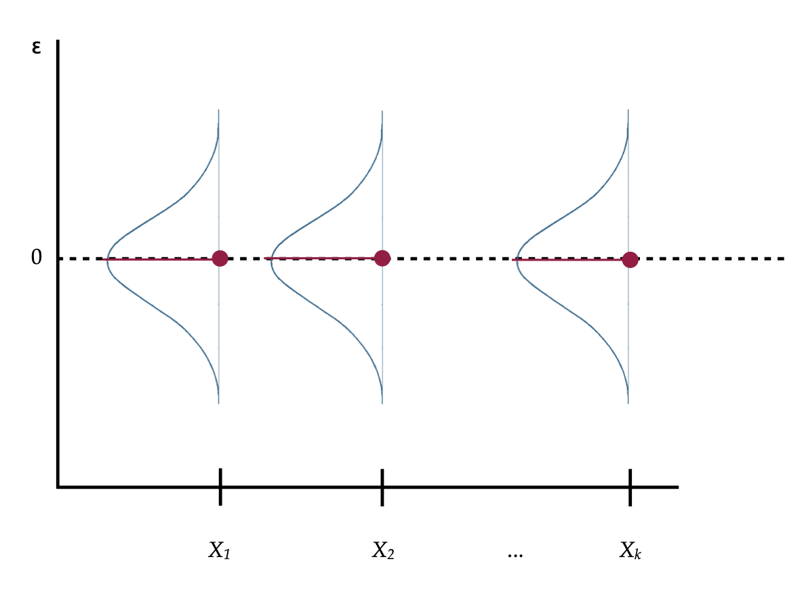

# Distributional Assumptions Underlying the Regression Model {#assumptions}


In this chapter, you will learn about the various distributional assumptions underlying the regression model. To do so, we will return to the [keith-gpa.csv](https://raw.githubusercontent.com/zief0002/modeling/master/data/keith.csv) data to examine whether time spent on homework is related to GPA (see the [data codebook](http://zief0002.github.io/epsy-8251/codebooks/keith-gpa.html)). To begin, we will load several libraries and import the data into an object called `keith`. 


```r
# Load libraries
library(corrr)
library(dplyr)
library(ggplot2)
library(patchwork)
library(readr)

# Read in data
keith = read_csv(file = "https://raw.githubusercontent.com/zief0002/modeling/master/data/keith-gpa.csv")
head(keith)
```

```
# A tibble: 6 x 3
    gpa homework parent_ed
  <dbl>    <dbl>     <dbl>
1    78        2        13
2    79        6        14
3    79        1        13
4    89        5        13
5    82        3        16
6    77        4        13
```

We will also fit a simple regression model that uses time spent on homework to predict variation in GPAs.


```r
# Fit simple regression model
lm.1 = lm(gpa ~ 1 + homework, data = keith)
```

<br />


## Four Distributional Assumptions Needed for Validity of Regression Results

Recall that the simple regression model is expressed as:

$$
Y_i = \beta_0 + \beta_1(X_i) + \epsilon_i
$$

There are several distributional assumptions we make about the errors ($\epsilon_i$ values) in the regression model in order for the results we obtain from fitting this model (e.g., coefficient estimates, $p$-values, CIs) to be valid. 

- [L]inearity
- [I]ndependence
- [N]ormality
- [E]qual variances (Homoskedasticity)

You can remember these assumptions using the mnemonic LINE. To better understand these assumptions, imagine that we had the population of *X*- and *Y*-values in which all the distributional assumptions were valid. Now imagine we plotted the ordered pairs, $(x_i,y_i)$, and we also regressed the *Y*-values on the  *X*-values and plotted this regression line as well. A visual depiction of this is shown in Figure 1. 

<div class="figure" style="text-align: center">

<p class="caption">(\#fig:unnamed-chunk-4)A visual depiction of *X*- and *Y*-values and regression line from a population in which the distributional assumptions are valid.</p>
</div>

In Figure 1, the normal distributions depicted are the distribution of *Y*-values at each value of *X*, or what we refer to as the conditional distributions of *Y*. Although only three conditional distributions are shown in Figure 1, there is a conditional distribution for EVERY value of *X*. 

Although the distributional assumptions are about the model's errors, we can also apply the assumptions to the conditional $Y$-values since they are [linear transformations](https://en.wikipedia.org/wiki/Linear_map) of the error terms. This allows us to use Figure 1 to expand upon each of the distributional assumptions listed earlier.

- **Linearity:** The linearity assumption implies that the MEAN values of $Y$ from all the conditional distributions all fall on the same line. If this is the case, we would say that the conditional mean $Y$-values are linear.
- **Independence:** This is not shown in the figure. The assumption is that each $Y$-value in a particular conditional distribution is independent from every other $Y$-value in that same distribution.
- **Normality:** This assumption indicates that every one of the conditional distributions of $Y$-values is normally distributed.
- **Equal variances:** This assumption says that the variance (or standard deviation) of all of the conditional distributions is exactly the same.

<br />


### Distributional Assumptions are Really About the Residuals

Stating these distributional assumptions in terms of the the conditional distributions of $Y$ was useful in helping us visualize them within a typical representation of the regression model through the relationship between $X$- and $Y$-values. Technically, however, all the distributional assumptions are about the conditional distributions of the residuals.^[This is true for other statistical models as well (e.g., ANOVA, $t$-test).] Think about how we compute the residuals:

$$
\epsilon_i = Y_i - \hat{Y}_i
$$
In Figure 1, the $\hat{Y}_i$ value is the $Y$-value that corresponds to the point on the line. Within each conditional distribution of *Y*, the $\hat{Y}_i$ is constant; in other words all of the observations with the same *X*-value will have the same $\hat{Y}_i$-value. That means within a conditional distribution, to compute the residual values, we are subtracting a constant:

$$
\epsilon_i = Y_i - C
$$

Remember from the [chapter on standardized regression](#cor), subtracting a constant from each value in a distribution shifts the center of the distribution. Pick any conditional distribution from Figure 1, which is a normal distribution centered at the $\hat{Y}_i$ value. Now subtract the $\hat{Y}_i$-value from each *Y*-value. This will re-center the normal distribution at 0. Thus, the conditional distribution of residuals is normally distributed, has a mean of 0, and has the same variance (or standard deviation) as the conditional distribution of *Y*-values. If we transform every *Y*-value in the population, from Figure 1, to a residual value, and re-plot them, the visual depiction now looks like this.

<div class="figure" style="text-align: center">

<p class="caption">(\#fig:unnamed-chunk-5)A visual depiction of the simple regression model's assumptions about the residuals.</p>
</div>

So if we restate the assumptions in terms of the residuals and the conditional distributions of the residuals,

- **Linearity:** The MEAN value of each of the conditional distributions of the residuals is 0.
- **Independence:** Again, this is not shown in the figure. The assumption is that each residual value in a particular conditional distribution is independent from every other residual value in that same distribution.
- **Normality:** This assumption indicates that each of the conditional distributions of residuals is normally distributed.
- **Equal variance:** The variance (or standard deviation) of all of the conditional distributions of residuals is exactly the same.

These assumptions can also be expressed mathematically as,

$$
\epsilon_{i|X} \overset{\mathrm{i.i.d~}}{\sim} \mathcal{N}\left(0, \sigma^2\right)
$$

The "i.i.d" stands for *independent and identically distributed*. The mathematical expression says the residuals conditioned on *X* (having the same *X*-value) are independent and identically normally distributed with a mean of 0 and some variance ($\sigma^2$).

<br />


## Evaluating the Distributional Assumptions

Before beginning to evaluate the distributional assumptions using our empirical data, it is important to point out that the assumptions are about the residuals *in the population*. Because in most analyses, we only have a sample of data, we can never really evaluate whether these assumptions are true. We can only offer a guess as to whether they are tenable given the data we see. The strongest arguments for justification for meeting any of the distibutional assumptions is a theoretical argument based on existing literature in the discipline. 

<br />


### Linearity

The linearity assumption is critical in specifying the structural part of the model. Fitting a linear model when the TRUE relationship between *X* and *Y* is non-linear may be quite problematic. Coefficients may be wrong. Predictions may also be wrong, especially at the extreme values for *X*. More importantly, mis-specified models lead to misinformed understandings of the world.

<div class="figure" style="text-align: center">

<p class="caption">(\#fig:unnamed-chunk-6)The left-hand plot shows observations simulated from a nonlinear model. The right-hand plot shows the same data and the results of fitting a linear model to non-linear data. Using the linear fitted model to make predictions would be quite misleading, especially at extreme values of *X*.</p>
</div>

In the left-hand plot of Figure 3, when the correct nonlinear model is fitted to the data, the conditional *Y*-values are scattered above and below the line at each *X*-value. In the right-hand plot of Figure 3, when a linear model was fitted to data generated from a non-linear function, the data tend to either be consistently above, or below the line, depending on the *X*-value. This type of systematic deviation would be evidence that the linearity assumption is not tenable. When evaluating this assumption, we want to see data in the scatterplot that is "equally" above and below the fitted regression line at each value of *X*. 


Since the linearity assumption also means that the average residual is 0, if we are evaluating this assumption by looking at a plot of the residuals, we would want to see residuals above (positive) and below (negative) 0. Figure 4 shows scatterplots of the residuals versus the *X*-values from the two fitted lines. In the left-hand plot, when the residuals are based on the true model, we see that the residuals are scattered above and below 0 at each value of *X*. In the right-hand plot, in which the residuals were computed based on a mis-specified linear model, we again see that the residuals are clustered above, or below 0, depending on the value of *X*.

<div class="figure" style="text-align: center">

<p class="caption">(\#fig:unnamed-chunk-7)The left-hand plot shows the residuals from the true nonlinear model versus the *X*-values. The right-hand plot shows the residuals from the mis-specified linear model versus the *X*-values. A reference line at $Y=0$ has also been added to the plot to aid interpretation.</p>
</div>


<br />


### Independence

The definition of independence relies on formal mathematics. Loosely speaking a set of observations is independent if knowing that one observation is above (or below) the mean value in a conditional distribution conveys no information about whether any other observation in the same conditional distribution is above (or below) its mean value. If observations are not independent, we say they are *dependent* or *correlated*.

Independence is not an assumption we can check graphically. To evaluate this assumption we need to know something about the how the data were collected or assigned to values of *X*. Using random chance in the design of the study, to either select observations (random sampling) or assign them to levels of the predictor (random assignment) will guarantee independence of the observations. Outside of this, independence is often difficult to guarantee, and often has to be a logical argument.

There are a few times that we can ascertain that the independence assumption would be violated. These instances often result from aspects of the data collection process. One such instance common to social science research is when the observations (i.e., cases, subjects) are collected within a physical or spatial proximity to one another. For example, this is typically the case when a researcher gathers a convenience sample based on location, such as sampling students from the same school. Another violation of independence occurs when observations are collected over time (longitudinally), especially when the observations are repeated measures from the same subjects.

One last violation of independence occurs when the observation level used to assign cases to the different predictor values (e.g., treatment or control) does not correspond to the observation level used in the analysis. For example, in educational studies whole classrooms are often assigned to treatment or control. That means that the cases used in the analysis, in order to satisfy the independence assumption, would need to be at the classroom level (e.g., the cases would need to be classroom means), not individual students. This can be deleterious for sample size.

If the independence assumption is violated, almost every value you get in the `tidy()` and `glance()` output---the standard errors, *t*-values, *F*-values, *p*-values, and residual standard errors (RMSE)---are wrong. If you suspect that the independence assumption is violated, then you will need to use a method (not OLS regression) that accommodates non-independence.^[We cover some of these methods in EPsy 8252.]

<br />


### Normality and Equal Variances

The assumption about normality is about the conditional distribution of errors at each value of *X*. This assumption is less critical than the assumptions of linearity and independence. It is only problematic for the OLS regression results if there are egregious violations of normality. In general, if the violations of these assumptions are only minor, the results of the OLS regression are still valid; we would say the results from an OLS regression are *robust* to violations of normality. Even if the violations are bad, there are many transformations of the data that can alleviate this problem.^[We will cover some of those transformations in EPsy 8252.]

Normal distributions are symmetric with the density of observations close to the mean. This means that in the scatterplot of the residuals versus the *X*-values, we want to see symmetry around 0 at each *X*-value and that most of the residuals are "close" to 0 ("Close" is hard to define as it depends on the standard deviation, remember that 68% of the residuals should be within one standard deviation, 95% within two standard deviations, etc.)


<div class="figure" style="text-align: center">

<p class="caption">(\#fig:unnamed-chunk-8)The left-hand plot shows conditional distributions of normally distributed residuals. The right-hand plot shows conditional distributions that are not normally distributed. The line $Y=0$ has also been included to aid interpretation.</p>
</div>

The residuals in the left-hand plot of Figure 4 are symmetric around 0 for each *X*-value. The bulk of the residuals at each *X*-value is near 0 and they become less dense the further from 0 they are, for both the positive and negative residual values. This is the pattern we want to see in empirical residuals. The residuals in the right-hand plot of Figure 4, are not symmetric around 0. They are also more dense in the negative values and then become less dense for higher positive values. This is evidence that the normality assumption is violated.


In the examples given in Figure 4, the number of observations and the shape of the conditional distributions make deviations from normality easier to spot. Evaluating the normality assumption in empirical data, which are often composed of fewer observations, is much more of a challenge. Moreover, evaluating the shape of distributions in a scatterplot is not an easy task.

Researchers often evaluate the normality assumption by examining the shape of the marginal distribution of the residuals. Figure 5 shows density plots of the marginal distributions for the same two sets of residuals plotted in Figure 4.


<div class="figure" style="text-align: center">

<p class="caption">(\#fig:unnamed-chunk-9)The left-hand plot shows conditional distributions of normally distributed residuals. The right-hand plot shows conditional distributions that are not normally distributed. The line $Y=0$ has also been included to aid interpretation.</p>
</div>

The marginal distribution in the right-hand plot clearly shows deviation from normality and we could safely say that the normality assumption is violated. We may be tempted to say that the marginal distribution in the left-hand plot also violates the assumption of normality as the density plot does not look normal. This would be a mistake. Remember that the assumptions are about the residuals in the population; the sample residuals may deviate from normality simply because of sampling error. Moreover, this looks like a minor violation of the normality assumption and is probably not an issue for the regression results.


### Equal Variances

Similar to the assumption about normality, the assumption of equal variances (homoskedasticity) is is less critical than the assumptions of linearity and independence, and only egregious violations of the assumption is problematic for the validity of the regression results.^[Again, there are many transformations of the data that can alleviate this problem.]

<div class="figure" style="text-align: center">

<p class="caption">(\#fig:unnamed-chunk-10)The left-hand plot shows conditional distributions of normally distributed residuals with equal variances. The center plot shows conditional distributions that are not normally distributed but still have equal variances. The right-hand plot shows conditional distributions that are normally distributed but have unequal variances. The line $Y=0$ has also been included in all plots to aid interpretation.</p>
</div>

When evaluating the assumption of equal variances, we want to see that the range of residual values at each *X*-value is roughly the same. For the left-hand and center plots in Figure 6, the range of residual values is roughly the same at each *X*-value, so we can conclude that the equal variances assumption is tenable. In the right-hand plot, the residuals show a pattern of variances that seems to be increasing for larger *X*-values. That is, the range of the residual values at smaller *X*-values is smaller than the range of the residual values at larger *X*-values. This is a violation of the equal variances assumption.

<br />


## Empirically Evaluating the Distributional Assumptions

We can use the residuals computed from the empirical data to evaluate the distributional assumptions of linearity, normality, and equal variances. (The assumption of independence is difficult to evaluate using the data, and is better left to a logical argument that refers to the study design.) Recall that the assumptions are about the residuals. To compute the residuals, we will use the `augment()` function from the **broom** package. We will also write those results into an object, `aug_1`, so we can compute on it later.


```r
# Load library
library(broom)

# Augment the model to get residuals
aug_1 = augment(lm.1)

# View augmented data
head(aug_1)
```


```
# A tibble: 6 x 8
    gpa homework .fitted .resid .std.resid   .hat .sigma  .cooksd
  <dbl>    <dbl>   <dbl>  <dbl>      <dbl>  <dbl>  <dbl>    <dbl>
1    78        2    76.7  -1.28      0.180 0.0328   7.28 0.000550
2    79        6    81.6   2.57     -0.358 0.0120   7.27 0.000776
3    79        1    75.5  -3.50      0.495 0.0500   7.27 0.00646 
4    89        5    80.4  -8.64      1.20  0.0100   7.22 0.00728 
5    82        3    77.9  -4.07      0.568 0.0204   7.26 0.00336 
6    77        4    79.1   2.15     -0.298 0.0128   7.27 0.000579
```

The cases in the augmented data frame are in the same order as the cases in the `keith` data frame. For example, the first case had a GPA of 78 and spent 2 hours a week on homework. The augmented data also includes several other useful measures for evaluating regression models. For now, we will focus on the `.fitted` column and the `.resid` column. Those columns contain the fitted values ($\hat{Y_i}$) and the residuals for each case based on the model fitted in `lm.1`.

We will examine two residual plots to help us evaluate the tenability of the assumptions: (1) a density plot of the marginal distribution of residuals, and (2) a scatterplot of the residuals versus the *X*-values. The density plot will allow us to eval;uate the normality assumption, and the scatterplot will allow us to evaluate the linearity and equal variances assumption. As we make these evaluations, remember that we do not have the entire population of residuals (we obtained our residuals by fitting a regression to a sample of data), so we do not expect that our residuals will actually meet the assumptions perfectly (remember, sampling error). Examining the sample residuals, is however, a reasonable way to evaluate the tenability of assumptions in practice. We just have to keep in mind that the sample residuals may deviate a bit from these assumptions.


```r
# Density plot of the residuals
ggplot(data = aug_1, aes(x = .resid)) +
  stat_density(geom = "line") +
  theme_bw() +
  xlab("Residual") +
  ylab("Probability density")

# Scatterplot of the residuals versus X
ggplot(data = aug_1, aes(x = homework, y = .resid)) +
  geom_point() +
  geom_hline(yintercept = 0) +
  theme_bw() +
  xlab("Time spent on homework (in hours)") +
  ylab("Residual")
```

<div class="figure" style="text-align: center">

<p class="caption">(\#fig:unnamed-chunk-13)LEFT: Density plot of the marginal distribution of residuals from the fitted regression model. RIGHT: Scatterplot of the residuals versus time spent on homework. The $Y=0$ line has been included as a reference for interpretation.</p>
</div>

The marginal distribution of residuals looks symmetric and bell-shaped. Based on this plot, the normality assumption seems tenable (or at least there is negligable violation of the assumption). The scatterplot of residuals versus time spent on homework shows random scatter around the line $Y=0$. This suggests that the average residual is roughly 0 at each *X*-value, and that the linearity assumption seems tenable. The range of the residuals at each *X*-value seems similar indicating that the assumption of equal variances is also tenable. Lastly, since the observations were randomly sampled (see [data codebook](http://zief0002.github.io/epsy-8251/codebooks/keith-gpa.html)) we believe the independence assumption is satisfied.

<br />


## Standardized Residuals

Often researchers standardize the residuals before performing the assumption checking. Using standardized residuals rather than unstandardized (raw) residuals does not change any of the previous findings. In fact, since standardizing is a linear transformation, the scatterplot and density plot look identical whether you use the unstandardized residuals or the standardized residuals. The only thing that changes is the scale on the residual axis of the plots. 

To standardize a residual, we subtract the mean of its conditional distribution and divide by the standard deviation. The distributional assumptions stated that the mean of each conditional distribution of the residuals is 0 and the standard deviation is the same, although unknown, namely $\sigma_{\epsilon}$. Mathematically, we standardize using:

$$
z_{\epsilon} = \frac{\epsilon - 0}{\mathrm{\sigma}_{\epsilon}}
$$

Unfortunately, we do not know what the value for $\sigma_{\epsilon}$, so we need to estimate it from the data. This adds uncertainty to the calculation of the standardized residual in the same way estimating the standard error in a normal distribution adds uncertainty and makes the distribution *t*-distributed. As such, we write the formula for the standardized residuals using a *t* rather than *z* and compute it as:

$$
t_{\epsilon} = \frac{\epsilon - 0}{\mathrm{\hat\sigma}_{\epsilon}}
$$

Since the *t*-distribution is also referred to as *Student's distribution*, standardized residuals are also sometimes referred to as *studentized residuals*.^[Technically they are *internally studentized residuals*.] What standardizing does for us is to put the residuals on a scale that uses the standard error. This allows us to judge whether particular residuals that look extreme (either highly positive or negative) are actually extreme or not. The standardized residuals are given in the augmented output in the `.std.resid` column.


```r
# Density plot of the residuals
ggplot(data = aug_1, aes(x = .std.resid)) +
  stat_density(geom = "line") +
  theme_bw() +
  xlab("Standardized residual") +
  ylab("Probability density")

# Scatterplot of the residuals versus X
ggplot(data = aug_1, aes(x = homework, y = .std.resid)) +
  geom_point() +
  geom_hline(yintercept = 0) +
  theme_bw() +
  xlab("Time spent on homework (in hours)") +
  ylab("Standardized residual")
```

<div class="figure" style="text-align: center">

<p class="caption">(\#fig:unnamed-chunk-14)LEFT: Density plot of the marginal distribution of standardized residuals from the fitted regression model. RIGHT: Scatterplot of the standardized residuals versus time spent on homework. The $Y=0$ line has been included as a reference for interpretation.</p>
</div>

The only thing that has changed between these plots and the previous plots of the unstandardized residuals is the scale. However, now we can identify observations with extreme residuals, because we can make use of the fact that most of the residuals (~95\%) should fall within two standard errors from the mean of 0. There are four students who have residuals of more than two standard errors. Given that we have $N=100$ observations, it is not surprising to see four observations more extreme than two standard errors; remember we expect to see 5\% just by random chance. If observations have really extreme residuals (e.g., $|t_{\epsilon}|>3.5$), it is often worth a second look since these extreme observations are interesting and may point to something going on in the data.

We can also `filter()` the augmented data to find these observations and to determine the exact value of the standardized residuals. Recall that the vertical line (`|`) means "OR".


```r
aug_1 %>% 
  filter(.std.resid <= -2 | .std.resid >= 2)
```

```
# A tibble: 4 x 8
    gpa homework .fitted .resid .std.resid   .hat .sigma .cooksd
  <dbl>    <dbl>   <dbl>  <dbl>      <dbl>  <dbl>  <dbl>   <dbl>
1    64        7    82.8   18.8      -2.62 0.0187   7.02  0.0655
2    67        7    82.8   15.8      -2.20 0.0187   7.09  0.0462
3    64        5    80.4   16.4      -2.27 0.0100   7.08  0.0261
4   100        7    82.8  -17.2       2.40 0.0187   7.06  0.0549
```

<br />


## Distributional Assumptions for the Multiple Regression Model

Recall that the model for a multiple regression (with two predictors) is a plane that is fitted using observations composed of ordered triples, $(X_1,X_2,Y)$. Figure 8 visually shows the multiple regression model's assumptions.

<div class="figure" style="text-align: center">

<p class="caption">(\#fig:unnamed-chunk-16)A visual depiction of the multiple regression model's assumptions.</p>
</div>

Now the conditional distributions that we put the assumptions on are the residuals (or *Y*-values) at each combination of ($X_1$, $x_2$). The assumptions for the multiple regression model are similar to those for the simple model, namely,

- **Linearity:** Notice from the visual that the MEAN values of each combination ($X_1$, $X_2$) are linear in both the $X_1$ and the $X_2$ directions. This implies that the mean of each of the conditional distributions of residuals is zero at ($X_1$, $X_2$).
- **Independence:** Again, this is not shown in the figure. The assumption is that each residual value in a particular conditional distribution is independent from every other residual value in that same distribution.
- **Normality:** This assumption indicates that each of the conditional distributions of residuals is normally distributed.
- **Homoskedasticity:** The variance (or standard deviation) of all of the conditional distributions of residuals is exactly the same.

To evaluate these assumptions, we will create the exact same plots we created to evaluate the assumptions in the simple regression model, with one twist. Rather than creating the scatterplot by plotting the standardized residuals versus the *X*-value, we will plot them against the FITTED values (i.e., the $\hat{Y}_i$ values). The fitted values from a multiple regression represent the weighted combination of both predictors, and thus give us the appropriate conditioning when we examine the distributions. (Remember, we want to consider the distribution of residuals at each ($X_1$, $X_2$) combination.)

As an example, we will regress student GPAs on both time spent on homework and parent education levels.


```r
# Fit the multiple regression model
lm.2 = lm(gpa ~ 1 + homework + parent_ed, data = keith)

# Augment the model to obtain the fitted values and residuals
aug_2 = augment(lm.2)
head(aug_2)
```

```
# A tibble: 6 x 9
    gpa homework parent_ed .fitted .resid .std.resid   .hat .sigma  .cooksd
  <dbl>    <dbl>     <dbl>   <dbl>  <dbl>      <dbl>  <dbl>  <dbl>    <dbl>
1    78        2        13    76.5  -1.48      0.212 0.0330   7.13 0.000512
2    79        6        14    81.3   2.34     -0.332 0.0122   7.12 0.000454
3    79        1        13    75.5  -3.47      0.502 0.0500   7.12 0.00441 
4    89        5        13    79.5  -9.52      1.35  0.0130   7.06 0.00801 
5    82        3        16    80.1  -1.88      0.270 0.0390   7.13 0.000988
6    77        4        13    78.5   1.50     -0.213 0.0145   7.13 0.000221
```

```r
# Density plot of the standardized residuals
ggplot(data = aug_2, aes(x = .std.resid)) +
  stat_density(geom = "line", color = "#c62f4b") +
  theme_bw() +
  xlab("Standardized residual") +
  ylab("Probability density")

# Plot the standardized residuals versus the fitted values
ggplot(data = aug_2, aes(x = .fitted, y = .std.resid)) +
  geom_point() +
  theme_bw() +
  geom_hline(yintercept = 0) +
  geom_hline(yintercept = c(-2, 2), linetype = "dashed") +
  xlab("Fitted values") +
  ylab("Standardized residual")
```

<div class="figure" style="text-align: center">

<p class="caption">(\#fig:unnamed-chunk-17)LEFT: Density plot of the marginal distribution of standardized residuals from the fitted regression model. RIGHT: Scatterplot of the standardized residuals versus time spent on homework. The $Y=0$, $Y=-2$ and $Y=2$ lines have been included as a references for interpretation.</p>
</div>

The density plot of the marginal distribution of standardized residuals is unimodal and roughly symmetric. There is deviation from normality, although this deviation seems minor and we note that the assumption of normality is robust to minor violations. The scatterplot shows random scatter around the $Y=0$ line which indicates that the mean residual value is close to 0 (linearity) for all fitted values. The range of the standardized residuals at each fitted value also seem roughly the same indicating that the equal variances assumption is also tenable. Lastly, since the observations were randomly sampled we believe the independence assumption is satisfied.

If any of the assumptions (aside from the independence assumption) do not seem reasonably satisfied, you can re-plot the residual plots based on the different simple regression models. (In this case we would look at the residuals versus time spent on homework and then the residuals versus parent education). This might help you identify if one, or both. of the predictors is the cause of the problem.

The reference lines in the scatterplot at $Y=-2$ and $Y=2$ help us identify observations with extreme residuals. (For large sample sizes these reference lines can be placed at $Y=-3$ and $Y=3$.) There are a few observations that have residuals that are more than two standard errors from the mean. This indicates students that have relatively high (positive residual) or low (negative residual) GPAs given the time they spend each week on homework and their parent education level.

<br />


## Regression Model Revisited

To this point, we have been writing the regression model as a mathematical expression of the relationship between some outcome ($Y$) and a set of predictors ($X_1,X_2,\ldots,X_k$), namely as,

$$
Y_i = \beta_0 + \beta_1(X_{1i}) + \beta_2(X_{2i}) + \ldots + \beta_k(X_{ki}) + \epsilon_i
$$

This is partially correct. A statistical model needs to represent the data generating process, which also embodies the set of underlying distributional assumptions. This implies that when we write out the regression model, it should include the mathematical relationship and the underlying distributional assumptions.

$$
\begin{gathered}
Y_i = \beta_0 + \beta_1(X_{1i}) + \beta_2(X_{2i}) + \ldots + \beta_k(X_{ki}) + \epsilon_i \\[2ex]
\mathrm{where}~\quad\epsilon_{i|X} \overset{\mathrm{i.i.d~}}{\sim}  \mathcal{N}\left(0, \sigma^2\right)
\end{gathered}
$$

<br />


## Advanced Plotting: Accounting for Sampling Uncertainty in the Density Plot

So far, when we have evaluated the normality assumption we have relied on our intuition (and experience) about whether the density plot of the marginal distribution of residuals was close to (or at least close enough to) normal. One thing we could do to help with this evaluation is to include a reference line showing normality as a basis of comparison. For example, here we again plot the marginal distribution of the standardized residuals from the fitted multiple regression. But this time, we also include the normal reference density.


```r
# Density plot of the standardized residuals
ggplot(data = aug_2, aes(x = .std.resid)) +
  stat_density(geom = "line", color = "#c62f4b") +
  stat_function(fun = dnorm, args = list(mean = 0, sd = 1), color = "black", linetype = "dashed") +
  theme_bw() +
  xlab("Standardized residual") +
  ylab("Probability density")
```

<div class="figure" style="text-align: center">

<p class="caption">(\#fig:unnamed-chunk-18)Density plot of the marginal distribution of standardized residuals from the fitted regression model (raspberry, solid line). The density for a ~N(0,1) distribution (black, dashed line) have been included as a comparative reference.</p>
</div>

The `stat_function()` layer uses the `dnorm()` function to plot the normal density. Since this is for the standardized residuals, we assume a mean of 0 and a standard deviation of 1 for this normal distribution. These parameters are included in the `args=list()` argument. The density of the standardized residuals is close to that for the normal distribution, although it is not perfect (e.g., flatter peak than normal). The big question is whether this deviation is more than we would expect because of sampling error?

To answer this question, we need to be able to visualize the uncertainty that is due to sampling error. To include

<div class="figure" style="text-align: center">

<p class="caption">(\#fig:unnamed-chunk-19)The density for a ~N(0,1) distribution (black, dashed line) and the sampling uncertainty associated with that normal distribution (blue shaded area).</p>
</div>

In this plot, the black, dashed line corresponds to where the density curve would lie if the distribution was normally distributed.  The blue shaded area is the confidence envelope for the normal distribution. In other words, it shows the area we would expect a density curve to lie in if it came from the normal distribution. 

To create this confidence envelope, we will use the `stat_density_confidence()` layer from the **educate** package (see below for instructions on how to install the **educate** package). We provide this layer the argument `model = "normal"`.


```r
# Load library
library(educate)

# Density plot of the standardized residuals
ggplot(data = aug_2, aes(x = .std.resid)) +
  stat_density_confidence(model = "normal") +
  stat_density(geom = "line", color = "#c62f4b") +
  theme_bw() +
  xlab("Standardized residual") +
  ylab("Probability density")
```

<div class="figure" style="text-align: center">

<p class="caption">(\#fig:unnamed-chunk-20)Density plot of the marginal distribution of standardized residuals from the fitted regression model (raspberry line). The sampling uncertainty associated with the normal distribution is also displayed (blue shaded area).</p>
</div>

The raspberry line depicting the density of the marginal distribution of standardized residuals lies completely within the blue area. This suggests that the deviation we saw earlier from the normal distribution is consistent with just being sampling error. Thus we conclude that the normality assumption is tenable.

<br />


### Installing the educate Package

The **educate** package is not available on CRAN, thus you cannot install it using the `Install` button in RStudio. To install this package, we need to use the `install_github()` function from the **remotes** package.

1. Use the `Install` button in RStudio to install the **remotes** package.
2. Once the **remotes** package has successfully installed, use the following syntax to install the **educate** package:


```r
remotes::install_github("zief0002/educate")
```

<br />

## Advanced Plotting: Loess Smooth to Help Evaluate Linearity

In the scatterplot of the standardized residuals versus the fitted values, we would expect that the average value of the residual at a given fitted value would be 0. The loess smoother helps us visualize the mean pattern in the actual data. We can then compare this to what would be expected (a constant mean pattern of 0) to evaluate the linearity assumption.

To add a loess smoother, we use the `geom_smooth()` function with the argument `method="loess"`. This will plot the loess line and also the confidence envelope around that loess line. This gives us an indication of the mean pattern in the data and its uncertainty. We would hope to see the line $Y=0$ (our expected pattern under linearity) encompassed in the uncertainty.


```r
ggplot(data = aug_2, aes(x = .fitted, y = .std.resid)) +
  geom_point() +
  geom_smooth(method = "loess") +
  theme_bw() +
  geom_hline(yintercept = 0) +
  xlab("Fitted values") +
  ylab("Standardized residual")
```

<div class="figure" style="text-align: center">

<p class="caption">(\#fig:unnamed-chunk-22)Scatterplot of the standardized residuals versus the fitted values from a regression model using time spent on homework and parent education level to predict GPA. A horizontal line at $Y=0$ shows the expected mean residual under the linearity assumption. The loess line (blue) and uncertainty bands (grey shaded area) are also displayed.</p>
</div>

Note that the loess line shows some deviation from the $Y=0$ line, however this is likely just due to sampling variation as the line $Y=0$ is encompassed in the confidence envelope. Because of this we would suggest that the linearity assumption is tenable.

<br />


## Advanced Plotting: Identify Observations with Extreme Residuals

It can be useful to identify particular observations in the residual plots directly. This can be useful as you explore the plots, and also to create plots for publications in which you wish to highlight particular cases. Rather than plotting points (`geom_point()`) for each observation, we can plot text for each observation using `geom_text()`. For example, you might imagine writing the name of each student in place of their point on the scatterplot. To do this, we need to:

1. Create an ID variable in the augmented data.
2. Use `geom_text()` rather than `geom_point()` in the ggplot syntax. In the `geom_text()` function we will set `label=` to the newly created ID variable, and since it is a variable in the data set, we will put that in an `aes()` function.

Since the original data set does not include an ID variable (e.g., names), we will use the row number from the original data as the ID. In other words the student in the first row will have an ID of 1, the student in the second row will have an ID of 2, etc.


```r
# Create ID variable in the augmented data
aug_2 = aug_2 %>% 
  mutate(id = row.names(keith))

# View new data
head(aug_2)
```

```
# A tibble: 6 x 10
    gpa homework parent_ed .fitted .resid .std.resid   .hat .sigma .cooksd id   
  <dbl>    <dbl>     <dbl>   <dbl>  <dbl>      <dbl>  <dbl>  <dbl>   <dbl> <chr>
1    78        2        13    76.5  -1.48      0.212 0.0330   7.13 5.12e-4 1    
2    79        6        14    81.3   2.34     -0.332 0.0122   7.12 4.54e-4 2    
3    79        1        13    75.5  -3.47      0.502 0.0500   7.12 4.41e-3 3    
4    89        5        13    79.5  -9.52      1.35  0.0130   7.06 8.01e-3 4    
5    82        3        16    80.1  -1.88      0.270 0.0390   7.13 9.88e-4 5    
6    77        4        13    78.5   1.50     -0.213 0.0145   7.13 2.21e-4 6    
```

```r
# Plot the id variable as text rather than points in the scatterplot
ggplot(data = aug_2, aes(x = .fitted, y = .std.resid)) +
  geom_text(aes(label = id), size = 4) +
  theme_bw() +
  geom_hline(yintercept = 0) +
  geom_hline(yintercept = -2, linetype = "dotted") +
  geom_hline(yintercept = 2, linetype = "dotted") +
  xlab("Fitted values") +
  ylab("Standardized residuals")
```

<div class="figure" style="text-align: center">

<p class="caption">(\#fig:unnamed-chunk-23)Scatterplot of the standardized residuals versus the fitted values from a regression model using time spent on homework and parent education level to predict GPA. The values plotted indicate the students' row numbers in the data. A horizontal line at $Y=0$ is included to aid interpretation.</p>
</div>

We can also plot points for some students and ID label for other students. For example, suppose we wanted to give the ID number for only those students with a standardized residual that was less than $-2$ or greater than 2, and plot a point otherwise. To do this, we would create the ID variable in the augmented data (which we have already done), then split the data frame into two data frames: one for those students with extreme residuals and one for those that have a non-extreme residual. Then we will call `geom_point()` for those in the non-extreme data set, and `geom_text()` for those in the extreme set. We do this by including a `data=` argument in one of those functions to reference a different data frame.


```r
# Create different data sets for the extreme and non-extreme observations
extreme = aug_2 %>% 
  filter(.std.resid <= -2 | .std.resid >= 2)

nonextreme = aug_2 %>% 
  filter(.std.resid > -2 & .std.resid < 2)

# Plot using text for the extreme observations and points for the non-extreme
ggplot(data = extreme, aes(x = .fitted, y = .std.resid)) +
  geom_text(aes(label = id), size = 4, color = "red") +
  geom_point(data = nonextreme) +
  theme_bw() +
  geom_hline(yintercept = 0) +
  xlab("Fitted values") +
  ylab("Standardized residual")
```

<div class="figure" style="text-align: center">

<p class="caption">(\#fig:unnamed-chunk-24)Scatterplot of the standardized residuals versus the fitted values from a regression model using time spent on homework and parent education level to predict GPA. Students with standardized residuals more than two standard errors from 0 are identified by their row number. A horizontal line at $Y=0$ is included to aid interpretation.</p>
</div>


