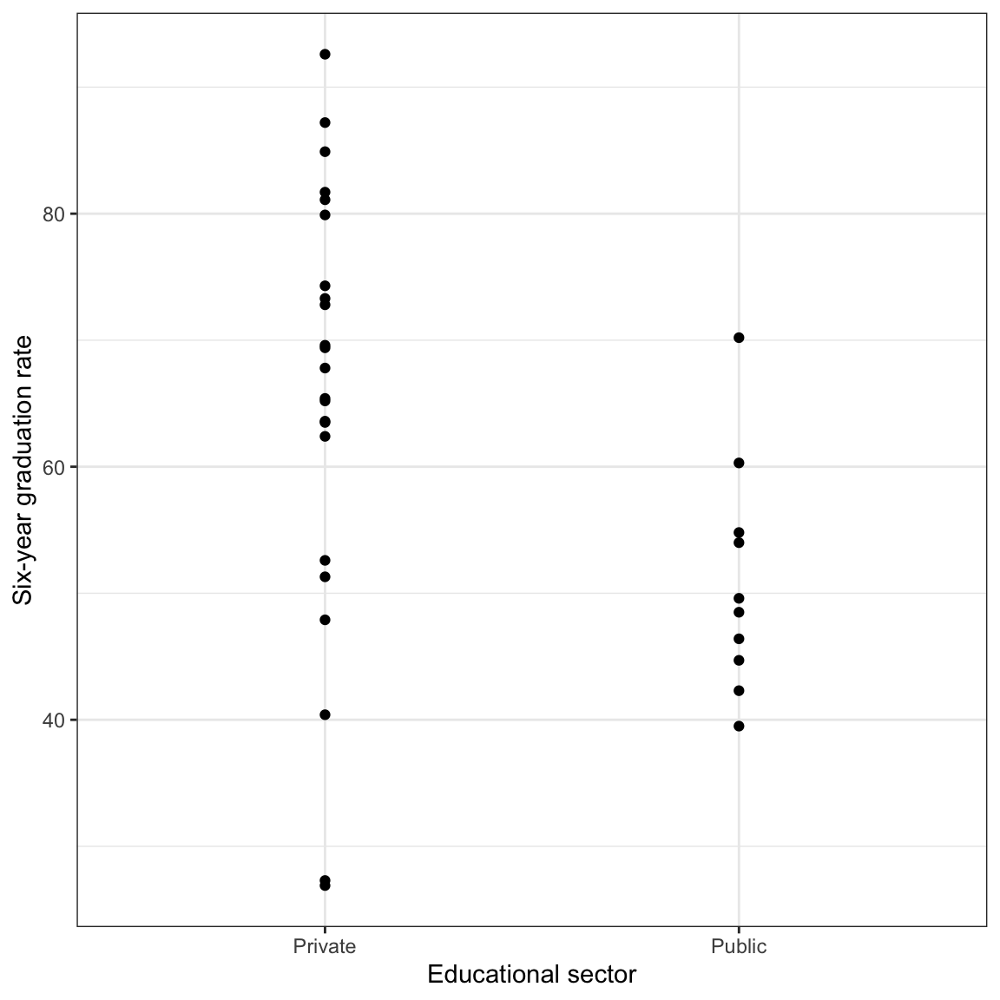
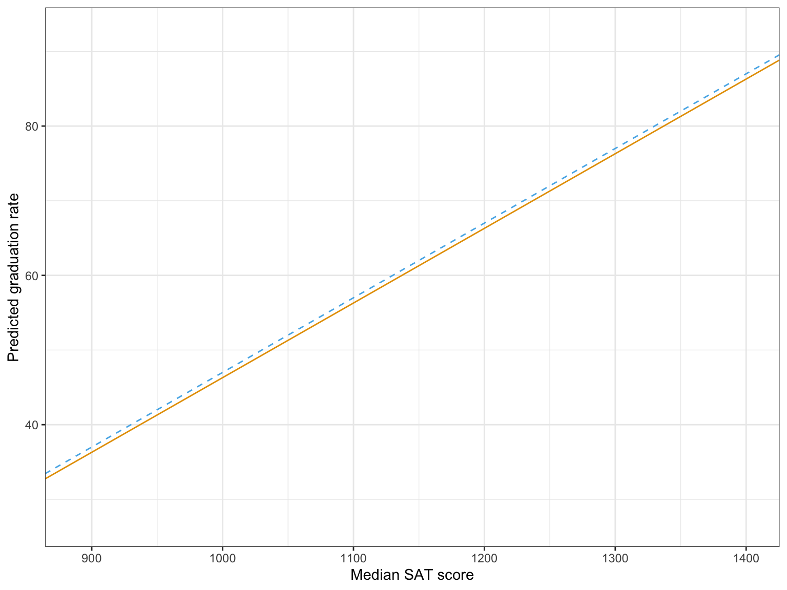

# Dummy Coding Categorical Predictors {#dummy}


In this chapter, you will learn about how to include categorical predictors in the regression model. To do so, we will use the [mn-schools.csv](https://raw.githubusercontent.com/zief0002/modeling/master/data/mn-schools.csv) data to examine whether there are differences in graduation rate between public and private colleges and universities (see the [data codebook](http://zief0002.github.io/epsy-8251/codebooks/mn-schools.html)). To begin, we will load several libraries and import the data into an object called `mn`. 


```r
# Load libraries
library(broom)
library(corrr)
library(dplyr)
library(educate)
library(ggplot2)
library(patchwork)
library(readr)

# Read in data
mn = read_csv(file = "https://raw.githubusercontent.com/zief0002/modeling/master/data/mn-schools.csv")
head(mn)
```

```
# A tibble: 6 x 5
  name                               grad sector    sat tuition
  <chr>                             <dbl> <chr>   <dbl>   <dbl>
1 Augsburg College                   65.2 Private  1030    39.3
2 Bethany Lutheran College           52.6 Private  1065    30.5
3 Bethel University, Saint Paul, MN  73.3 Private  1145    39.4
4 Carleton College                   92.6 Private  1400    54.3
5 College of Saint Benedict          81.1 Private  1185    43.2
6 Concordia College at Moorhead      69.4 Private  1145    36.6
```

<br />


## Data Exploration

To begin, as always, we will plot the marginal distributions of graduation rates (`grad`) and educational sector (`sector`). Since educational sector is a categorical variable, rather than creating a density plot of the marginal distribution, we will create a bar plot. We will also create a scatterplot of graduation rates versus educational sector.  


```r
# Density plot of graduation rates
ggplot(data = mn, aes(x = grad)) +
  stat_density(geom = "line", color = "#c62f4b") +
  theme_bw() +
  xlab("Six-year graduation rate") +
  ylab("Probability density")

# Bar plot of education sector
ggplot(data = mn, aes(x = sector)) +
  geom_bar(fill = "#c62f4b") +
  theme_bw() +
  xlab("Educational sector") +
  ylab("Frequency")

# Scatterplot
ggplot(data = mn, aes(x = sector, y = grad)) +
  geom_point() +
  theme_bw() +
  xlab("Educational sector") +
  ylab("Six-year graduation rate")
```

<div class="figure" style="text-align: center">

<p class="caption">(\#fig:unnamed-chunk-3)LEFT: Density plot of six-year graduation rates. CENTER: Bar plot of education sector. RIGHT: Scatterplot of the six-year graduation rate versus educational sector.</p>
</div>

We will also compute the means, standard deviations, and sample sizes for private and public schools.


```r
mn %>% 
  group_by(sector) %>%
  summarize(
    M = mean(grad),
    SD = sd(grad),
    N = length(grad)
  )
```


<table style="width:40%; margin-left: auto; margin-right: auto;" class="table">
<caption>(\#tab:unnamed-chunk-5)Mean (M), standard deviation (SD), and sample size (N) of the six-year graduation rates for 33 Minnesota colleges and universities conditioned on educational sector.</caption>
 <thead>
  <tr>
   <th style="text-align:left;text-align: center;"> Sector </th>
   <th style="text-align:center;text-align: center;"> M </th>
   <th style="text-align:center;text-align: center;"> SD </th>
   <th style="text-align:center;text-align: center;"> N </th>
  </tr>
 </thead>
<tbody>
  <tr>
   <td style="text-align:left;"> Private </td>
   <td style="text-align:center;"> 65.27 </td>
   <td style="text-align:center;"> 17.58 </td>
   <td style="text-align:center;"> 23 </td>
  </tr>
  <tr>
   <td style="text-align:left;"> Public </td>
   <td style="text-align:center;"> 51.03 </td>
   <td style="text-align:center;"> 9.16 </td>
   <td style="text-align:center;"> 10 </td>
  </tr>
</tbody>
</table>


We note a couple differences in the distribution of graduation rates between public and private schools. First, the mean graduation rates are different. Private schools have a graduation rate that is, on average, 14.2 percentage points higher than public schools. There is also more variation in private schools' graduation rates than in public schools' graduation rates. Lastly, we note that the sample sizes are not equal. There are 13 more private schools than there are public schools in the data set.

<br />


## Indicator Variables

Before we can compute correlations or fit a regression model, we need to convert educational sector into a numeric variable. In this numeric variable, we will assign the public schools one value, and the private schools another value. The numbers are just stand-ins for the category. As such, they are referred to as *indicator variables*, since the numerical values only indicate a category. 

For example, here we will code public schools as 5 and private schools as 10. To create this new indicator variable, we `mutate()` a new column (called `indicator`) onto our `mn` data frame that takes the value of 5 if `sector` is `Public` and 10 if `sector` is `Private`. Here we use the `if_else()` function to carry out this logic.


```r
# Create indicator variable
mn = mn %>%
  mutate(
    indicator = if_else(sector == "Public", 5, 10)
  )

# Examine data frame
head(mn)
```

```
# A tibble: 6 x 6
  name                               grad sector    sat tuition indicator
  <chr>                             <dbl> <chr>   <dbl>   <dbl>     <dbl>
1 Augsburg College                   65.2 Private  1030    39.3        10
2 Bethany Lutheran College           52.6 Private  1065    30.5        10
3 Bethel University, Saint Paul, MN  73.3 Private  1145    39.4        10
4 Carleton College                   92.6 Private  1400    54.3        10
5 College of Saint Benedict          81.1 Private  1185    43.2        10
6 Concordia College at Moorhead      69.4 Private  1145    36.6        10
```


Now, we can then use this new indicator variable in correlation and regression analyses.


```r
# Correlation
mn %>%
  select(grad, indicator) %>%
  correlate() %>%
  fashion(decimals = 3)
```

```
    rowname  grad indicator
1      grad            .397
2 indicator  .397          
```

The correlation between  educational sector and graduation rate is small and positive, indicating that institutions with higher graduation rates tend to have higher values on the indicator variable. Since there are only two values mapped to the `sector` variable, this implies that institutions with higher graduation rates tend to be private institutions.


```r
# Fit regression model
lm.1 = lm(grad ~ 1 + indicator, data = mn)

# Model-level output
print(glance(lm.1), width = Inf)
```

```
# A tibble: 1 x 12
  r.squared adj.r.squared sigma statistic p.value    df logLik   AIC   BIC
      <dbl>         <dbl> <dbl>     <dbl>   <dbl> <dbl>  <dbl> <dbl> <dbl>
1     0.158         0.130  15.6      5.80  0.0222     1  -136.  279.  283.
  deviance df.residual  nobs
     <dbl>       <int> <int>
1    7552.          31    33
```

```r
# Coefficient-level output
tidy(lm.1)
```

```
# A tibble: 2 x 5
  term        estimate std.error statistic p.value
  <chr>          <dbl>     <dbl>     <dbl>   <dbl>
1 (Intercept)    36.8      10.4       3.54 0.00129
2 indicator       2.85      1.18      2.41 0.0222 
```

Differences in these indicator values (i.e., educational sector) explain 15.75\% of the variation in graduation rates. This is statistically reliable, $F(1, 31) = 5.80$, $p=0.022$. Interpreting the coefficients,

- The average graduation rate for schools coded as 0 on the indicator variable is 36.8\% ($t(31)=3.54$, $p = 0.001$). Since the mapping we used (5 and 10) did not include 0, the intercept and inferential information related to the intercept are meaningless.
- Institutions that have coding values that are one-unit differences have, on average, a graduation rate that is 2.85 percentage points different ($t(31)=2.41$, $p=0.022$). The slope information in its current form is also meaningless. But, since the model is linear, we can translate the slope information to be more meaningful. In our mapping, the difference between public and private schools was a 5-point difference. We can use this to compute the difference in graduation rates between these two sectors,

$$
\mathrm{Difference} = 5 \times 2.85 = 14.3 
$$

We could also have substituted the mapped values of 5 and 10 into the fitted regression equation to obtain the same result. Substituting the indicator values into the fitted equation, we find the predicted average graduation rates for public and private schools:

$$
\begin{split}
\mathbf{Private:~}\hat{\mathrm{Graduation~Rate}_i} &= 36.8 + 2.85(10) = 65.3 \\[2ex]
\mathbf{Public:~}\hat{\mathrm{Graduation~Rate}_i} &= 36.8 + 2.85(5) = 51 \\[2ex]
\end{split}
$$
The difference in these average graduation rates comes out to 14.3. The *p*-value associated with the slope coefficient suggests that this difference (or any difference between different values of *X* computed from the model) is more than we expect because of chance, so we conclude that there is a difference between the average graduation rates of public and private schools. What if we would have used different values in the indicator variable. Let's try this mapping:

$$
\mathrm{Indicator}_2 = \begin{cases}
2 \quad \mathrm{for~Public}\\
7 \quad \mathrm{for~Private}
\end{cases}
$$


```r
# Create indicator variable
mn = mn %>%
  mutate(
    indicator_2 = if_else(sector == "Public", 2, 7)
  )

# Examine data frame
head(mn)
```

```
# A tibble: 6 x 7
  name                           grad sector   sat tuition indicator indicator_2
  <chr>                         <dbl> <chr>  <dbl>   <dbl>     <dbl>       <dbl>
1 Augsburg College               65.2 Priva…  1030    39.3        10           7
2 Bethany Lutheran College       52.6 Priva…  1065    30.5        10           7
3 Bethel University, Saint Pau…  73.3 Priva…  1145    39.4        10           7
4 Carleton College               92.6 Priva…  1400    54.3        10           7
5 College of Saint Benedict      81.1 Priva…  1185    43.2        10           7
6 Concordia College at Moorhead  69.4 Priva…  1145    36.6        10           7
```

Using this second indicator to compute correlations and in the regression model, we find:


```r
# Correlation
mn %>%
  select(grad, indicator_2) %>%
  correlate() %>%
  fashion(decimals = 3)
```

```
      rowname  grad indicator_2
1        grad              .397
2 indicator_2  .397            
```

```r
# Fit regression model
lm.2 = lm(grad ~ 1 + indicator_2, data = mn)

# Model-level output
print(glance(lm.2), width = Inf)
```

```
# A tibble: 1 x 12
  r.squared adj.r.squared sigma statistic p.value    df logLik   AIC   BIC
      <dbl>         <dbl> <dbl>     <dbl>   <dbl> <dbl>  <dbl> <dbl> <dbl>
1     0.158         0.130  15.6      5.80  0.0222     1  -136.  279.  283.
  deviance df.residual  nobs
     <dbl>       <int> <int>
1    7552.          31    33
```

```r
# Coefficient-level output
tidy(lm.2)
```

```
# A tibble: 2 x 5
  term        estimate std.error statistic     p.value
  <chr>          <dbl>     <dbl>     <dbl>       <dbl>
1 (Intercept)    45.3       7.03      6.45 0.000000346
2 indicator_2     2.85      1.18      2.41 0.0222     
```
The correlation between  educational sector and graduation rate and the model-level output is exactly the same. Institutions with higher graduation rates tend to have higher values on the indicator variable (private institutions). Differences in these indicator values (i.e., educational sector) explain 15.75\% of the variation in graduation rates. This is statistically reliable, $F(1, 31) = 5.80$, $p=0.022$.

In the coefficient-level output, the slope output is the same as when we used the values of 5 and 10 ($\hat\beta_1=2.85$, $t(31)=2.41$, $p=0.022$). Institutions that have coding values that are one-unit differences have, on average, a graduation rate that is 2.85 percentage points different ($t(31)=2.41$, $p=0.022$). Substituting the indicator values into the fitted equation, we find the predicted average graduation rates for public and private schools:

$$
\begin{split}
\mathbf{Private:~}\hat{\mathrm{Graduation~Rate}_i} &= 45.3 + 2.85(7) = 65.25 \\[2ex]
\mathbf{Public:~}\hat{\mathrm{Graduation~Rate}_i} &= 45.3 + 2.85(2) = 51 \\[2ex]
\end{split}
$$


The intercept coefficient, and subsequently inferential output, are different. This is because in our second indicator variable, the code of 0 is in a different location relative to the values of 2 and 7 than it was when we used 5 and 10. In reality, it doesn't matter because 0 is not a legitimate mapping in either indicator variable (remember the values represent categories!).

<br />


### Dummy Coding

Since regardless of the values we choose for the indicator variable, we get similar results we can make use of the interpretational value of the intercept and slope to help select our mapped values. For example, since the intercept is the average *Y*-value for an *X*-value of 0, we should choose on of our mapped values to be 0. Also, since the slope gives us a difference in the average *Y*-value for a one-unit difference in *X*, we can choose our other value to correspond to a mapping that is one-unit higher than 0, namely 1. Our mapping is then,

$$
\mathrm{Indicator} = \begin{cases}
0 \quad \mathrm{for~Public}\\
1 \quad \mathrm{for~Private}
\end{cases}
$$


```r
# Create indicator variable
mn = mn %>%
  mutate(
    private = if_else(sector == "Private", 1, 0)
  )

# Examine data frame
head(mn)
```

```
# A tibble: 6 x 8
  name                   grad sector   sat tuition indicator indicator_2 private
  <chr>                 <dbl> <chr>  <dbl>   <dbl>     <dbl>       <dbl>   <dbl>
1 Augsburg College       65.2 Priva…  1030    39.3        10           7       1
2 Bethany Lutheran Col…  52.6 Priva…  1065    30.5        10           7       1
3 Bethel University, S…  73.3 Priva…  1145    39.4        10           7       1
4 Carleton College       92.6 Priva…  1400    54.3        10           7       1
5 College of Saint Ben…  81.1 Priva…  1185    43.2        10           7       1
6 Concordia College at…  69.4 Priva…  1145    36.6        10           7       1
```

Using a 0, and 1 coding for an indicator variable is referred to as *dummy coding*. Conventionally, we name an indicator variable that employs dummy coding with the category that is mapped to 1. In the syntax, private schools are mapped to 1, and hence the indicator variable is named `private`. The category mapped to 0 is known as the *reference category*, or *reference group*. Here public schools are the reference group.

Using the dummy coded indicator to compute correlations and fit the regression model, we find:


```r
# Correlation
mn %>%
  select(grad, private) %>%
  correlate() %>%
  fashion(decimals = 3)
```

```
  rowname  grad private
1    grad          .397
2 private  .397        
```

```r
# Fit regression model
lm.3 = lm(grad ~ 1 + private, data = mn)

# Model-level output
print(glance(lm.3), width = Inf)
```

```
# A tibble: 1 x 12
  r.squared adj.r.squared sigma statistic p.value    df logLik   AIC   BIC
      <dbl>         <dbl> <dbl>     <dbl>   <dbl> <dbl>  <dbl> <dbl> <dbl>
1     0.158         0.130  15.6      5.80  0.0222     1  -136.  279.  283.
  deviance df.residual  nobs
     <dbl>       <int> <int>
1    7552.          31    33
```

```r
# Coefficient-level output
tidy(lm.3)
```

```
# A tibble: 2 x 5
  term        estimate std.error statistic  p.value
  <chr>          <dbl>     <dbl>     <dbl>    <dbl>
1 (Intercept)     51.0      4.94     10.3  1.44e-11
2 private         14.2      5.91      2.41 2.22e- 2
```
The correlation between  educational sector and graduation rate and the model-level output is exactly the same. Institutions with higher graduation rates tend to have higher values on the indicator variable (private institutions). Differences in these indicator values (i.e., educational sector) explain 15.75\% of the variation in graduation rates. This is statistically reliable, $F(1, 31) = 5.80$, $p=0.022$.

The fitted equation is:

$$
\hat{\mathrm{Graduation~Rate}_i} = 51 + 14.2(\mathrm{Private_i})
$$

Interpreting the coefficients,

- The average graduation rate for schools coded as 0 on the indicator variable is 51\%.
- Each one-unit difference on the indicator variable have, on average, a graduation rate that is 14.2 percentage points different.

Since 0 represented the private schools the intercept is the average graduation rate for public schools. In general, when using dummy coding, the intercept will be the average *Y*-value for the reference group. The inferential test, $H_0:\beta_0=0$, tests whether the average *Y*-value for the reference group is 0. (Sometimes this is relevant and other times it is not, depending whether this is of substantive interest.) In our example, we find that the empirical data is not consistent with the average graduation rate for public schools being 0%; $t(31)=10.34$, $p < 0.001$. 

The slope coefficient now represents the difference in average graduation rates between public and private schools as their dummy codes were one-unit apart. In general, when using dummy coding, the slope gives the difference between the category labeled 1 and the reference group. The test of the parameter, $H_0:\beta_1=0$, is a direct test of whether the difference in average graduation rates is different than 0; or that public and private schools having the same graduation rate. Here we find that the empirical data is not consistent with the average graduation rates between public and private schools being the same; $t(31)=2.41$, $p=0.022$. 

Putting these contextual queues around the interpretations, we interpret the coefficients as:

- The average graduation rate for public schools is 51\%.
- Private schools have a graduation rate that is 14.2 percentage points, on average, higher than public schools.

<br />


### Making Private Schools the Reference Group

What happens if we had coded the predictor so that private schools were the reference group (coded as 0), and public schools were coded as 1?


```
# A tibble: 6 x 9
  name            grad sector   sat tuition indicator indicator_2 private public
  <chr>          <dbl> <chr>  <dbl>   <dbl>     <dbl>       <dbl>   <dbl>  <dbl>
1 Augsburg Coll…  65.2 Priva…  1030    39.3        10           7       1      0
2 Bethany Luthe…  52.6 Priva…  1065    30.5        10           7       1      0
3 Bethel Univer…  73.3 Priva…  1145    39.4        10           7       1      0
4 Carleton Coll…  92.6 Priva…  1400    54.3        10           7       1      0
5 College of Sa…  81.1 Priva…  1185    43.2        10           7       1      0
6 Concordia Col…  69.4 Priva…  1145    36.6        10           7       1      0
```

Using the dummy coded indicator to compute correlations and fit the regression model, we find:


```r
# Correlation
mn %>%
  select(grad, public) %>%
  correlate() %>%
  fashion(decimals = 3)
```

```
  rowname  grad public
1    grad        -.397
2  public -.397       
```

```r
# Fit regression model
lm.4 = lm(grad ~ 1 + public, data = mn)

# Model-level output
print(glance(lm.4), width = Inf)
```

```
# A tibble: 1 x 12
  r.squared adj.r.squared sigma statistic p.value    df logLik   AIC   BIC
      <dbl>         <dbl> <dbl>     <dbl>   <dbl> <dbl>  <dbl> <dbl> <dbl>
1     0.158         0.130  15.6      5.80  0.0222     1  -136.  279.  283.
  deviance df.residual  nobs
     <dbl>       <int> <int>
1    7552.          31    33
```

```r
# Coefficient-level output
tidy(lm.4)
```

```
# A tibble: 2 x 5
  term        estimate std.error statistic  p.value
  <chr>          <dbl>     <dbl>     <dbl>    <dbl>
1 (Intercept)     65.3      3.25     20.1  2.61e-19
2 public         -14.2      5.91     -2.41 2.22e- 2
```

The correlations and model-level output are exactly the same, except that the sign on the correlation is now negative since we switched the order of the coding so that private schools were mapped to a lower value (0) and public school were mapped to a higher value (1). The fitted equation is:

$$
\hat{\mathrm{Graduation~Rate}_i} = 65.3 - 14.2(\mathrm{Public_i})
$$

Interpreting the coefficients,

- The average graduation rate for private schools is 65.3\%. 
- Public schools have a graduation rate that is 14.2 percentage points, on average, lower than private schools.

The inferential test for the intercept now examines whether the average graduation rate for private schools (reference group) is different than 0%. The test for slope is still evaluating whether there is a difference between the average graduation rates between private and public schools. Although the coefficient has the opposite sign, the *p*-value is still identical.

<br />


## Assumption Checking

Like any other regression model, we need to examine whether or not the model's assumptions are tenable. We look at (1) the marginal distribution of the standardized residuals, and (2) the scatterplot of the standardized residuals versus the model's fitted values. The only difference is that *with only categorical predictors in the model, we do not have to worry about the linearity assumption*. Since there is no ordinal quality to the predictor space, the average residual will always be zero when there are only categorical predictors in the model. (Once we add any quantitative covariates we will again have to evaluate this assumption.)


```r
# Obtain the fitted values and residuals
aug_4 = augment(lm.4)

# View augmented data frame
head(aug_4)
```

```
# A tibble: 6 x 8
   grad public .fitted   .resid .std.resid   .hat .sigma     .cooksd
  <dbl>  <dbl>   <dbl>    <dbl>      <dbl>  <dbl>  <dbl>       <dbl>
1  65.2      0    65.3   0.0652   -0.00427 0.0435   15.9 0.000000415
2  52.6      0    65.3  12.7      -0.830   0.0435   15.7 0.0156     
3  73.3      0    65.3  -8.03      0.526   0.0435   15.8 0.00630    
4  92.6      0    65.3 -27.3       1.79    0.0435   15.0 0.0729     
5  81.1      0    65.3 -15.8       1.04    0.0435   15.6 0.0245     
6  69.4      0    65.3  -4.13      0.271   0.0435   15.8 0.00167    
```

```r
# Density plot of the marginal standardized residuals
ggplot(data = aug_4, aes(x = .std.resid)) +
  stat_density_confidence(model ="normal") +
  stat_density(geom = "line", color = "#c62f4b") +
  theme_bw() +
  xlab("Standardized residual") +
  ylab("Probability density")

# Scatterplot of the standardized residuals versus the fitted values
ggplot(data = aug_4, aes(x = .fitted, y = .std.resid)) +
  geom_point() +
  geom_hline(yintercept = 0) +
  theme_bw() +
  xlab("Fitted value") +
  ylab("Standardized residual")
```

<div class="figure" style="text-align: center">

<p class="caption">(\#fig:unnamed-chunk-15)LEFT: Density plot of the marginal distribution of standardized residuals from a regression model using educational sector to predict variation in six-year graduation rates (raspberry line). The sampling uncertainty associated with the normal distribution is also displayed (blue shaded area). RIGHT: Scatterplot of the standardized residuals versus the fitted values from the same model. A horizontal line at $Y=0$ shows the expected mean residual under the linearity assumption. The loess line (blue) and uncertainty bands (grey shaded area) are also displayed.</p>
</div>

From the scatterplot, we see that there is some question about the tenability of the equal variances assumption. The variation in the private schools' residuals seems greater than the variation in the public schools' residuals. (This was foreshadowed earlier when we examined the standard deviations of the two distributions.) This difference in variation, however, might be due to the extreme private school that has a residual that is less than $-2$. Additionally, this assumption violation might not be a problem once we add other predictors to the model. So, for now, we will move on, but will re-check this assumption after fitting additional models.

The *marginal* distribution of the residuals does not show evidence of mis-fit with the normality assumption. Since the predictor has only two levels, we could actually examine the distribution of residuals for each sector. Here we do so as a pedagogical example, but note that once other non-categorical predictors are included, this can no longer be done. To examine the conditional distributions, we will filter the augmented data by sector and then plot each sector's residuals separately.


```r
# Get private schools
aug_private = aug_4 %>% 
  filter(public == 0)

# Get public schools
aug_public = aug_4 %>% 
  filter(public == 1)

# Density plot of the private schools' standardized residuals
ggplot(data = aug_private, aes(x = .std.resid)) +
  stat_density_confidence(model = "normal") +
  stat_density(geom = "line", color = "#c62f4b") +
  theme_bw() +
  xlab("Standardized residual") +
  ylab("Probability density")

# Density plot of the public schools' standardized residuals
ggplot(data = aug_public, aes(x = .std.resid)) +
  stat_density_confidence(model = "normal") +
  stat_density(geom = "line", color = "#c62f4b") +
  theme_bw() +
  xlab("Standardized residual") +
  ylab("Probability density")
```

<div class="figure" style="text-align: center">

<p class="caption">(\#fig:unnamed-chunk-16)Density plot of the standardized residuals from the regression model using educational sector to predict variation in six-year graduation rates for  private (LEFT) and public (RIGHT) colleges and universities (raspberry line). The sampling uncertainty associated with the normal distribution is also displayed (blue shaded area) for both sets of schools.</p>
</div>

The normality assumption seems tenable since neither *conditional* distribution of residuals seem to indicate more mis-fit to normality than would be expected from sampling error. Lastly, we wonder if the independence assumption is tenable. It might seem reasonable that there is some dependence among graduation rates given that multiple schools may be related to one another (e.g., University of Minnesota--Twin Cities and Duluth). Dependence also arises because of spatial proximity. Since schools are located in particular geographic areas within Minnesota, thi might also be a problem.  


<br />


## Including Other Predictors

Based on the results from fitting the simple regression model, there seems to be differences between the average graduation rate between public and private institutions. It may, however, be that the private schools are just more selective and this selectivity is the cause of the differences in graduation rates. To examine this, we will include the median SAT score (`sat`) as a covariate into our model. So now, the regression model will include both the `public` dummy coded predictor and the `sat` predictors in an effort to explain variation in graduation rates.

Prior to fitting the regression model, we will examine the correlation matrix.


```r
mn %>%
  select(grad, private, sat) %>%
  correlate() %>%
  fashion(decimals = 3)
```

```
  rowname  grad private   sat
1    grad          .397  .889
2 private  .397          .194
3     sat  .889    .194      
```

From the correlation matrix we see:

- Private institutions tend to have higher graduation rates than public institutions ($r = 0.397$).
- Institutions with higher median SAT scores tend to have higher graduation rates ($r=0.889$).
- Private institutions tend to have higher median SAT scores than public institutions ($r = 0.194$).

Fitting the regeression model


```r
lm.5 = lm(grad ~ 1 + sat + private, data = mn)

# Model-level output
print(glance(lm.5), width = Inf)
```

```
# A tibble: 1 x 12
  r.squared adj.r.squared sigma statistic  p.value    df logLik   AIC   BIC
      <dbl>         <dbl> <dbl>     <dbl>    <dbl> <dbl>  <dbl> <dbl> <dbl>
1     0.843         0.832  6.86      80.3 9.05e-13     2  -109.  226.  232.
  deviance df.residual  nobs
     <dbl>       <int> <int>
1    1411.          30    33
```

Differences in educational sector and median SAT score explain 84.26\% of the variation in graduation rates. This is statistically reliable, $F(2, 30) = 80.27$, $p<0.001$.


```r
# Coefficient-level output
tidy(lm.5)
```

```
# A tibble: 3 x 5
  term        estimate std.error statistic  p.value
  <chr>          <dbl>     <dbl>     <dbl>    <dbl>
1 (Intercept)  -84.4     12.1        -7.00 8.76e- 8
2 sat            0.127    0.0111     11.4  1.88e-12
3 private        8.38     2.65        3.16 3.55e- 3
```

The fitted equation is:

$$
\hat{\mathrm{Graduation~Rate}_i} = -84.4 + 0.13(\mathrm{SAT}_i) + 8.4(\mathrm{Private_i})
$$

Interpreting the coefficients,

- The average graduation rate for private schools that have a median SAT score of 0 is $-84.4$%. (extrapolation)
- A ten-point difference in median SAT score is associated with a 1.3 percentage point difference in graduation rate, controlling for differences in educational sector. (Here we interpret using a factor of 10.)
- Private schools, on average, have a graduation rate that is 8.4 percentage points higher than public schools (reference group), controlling for differences in median SAT scores.

Based on our research question, the focal predictor in this model is the coefficient and test associated with `private`. The $t$-test associated with the partial slope for `private` suggests that the *controlled difference* in means between private and public schools is likely not 0 ($p=0.004$) given the empirical evidence. Thus, even after controlling for differences in institution selectivity, we believe there is still a difference in private and public schools' graduation rates, on average.

<br />


### Analysis of Covariance (ANCOVA)

Our research question in the controlled model, fundamentally, is: *Is there a difference on Y between group A and group B, after controlling for covariate Z?* We can make the question more complex by having more than two groups (say group A, group B, and group C), or by controlling for multiple covariates. But, the primary question is whether there are group differences on some outcome after controlling for one or more covariates.

In the social sciences, the methodology used to analyze group differences when controlling for other predictors is referred to as *analysis of covariance*, or ANCOVA. ANCOVA models can be analyzed using a framework that focuses on partitioning variation (ANOVA) or using regression as a framework. Both ultimately give the same results ($p$-values, etc.). In this course we will focus using the regression framework to analyze this type of data.

<br />


### Adjusted Means

Since the focus of the analysis is to answer whether there is a difference in graduation rates between private and public schools, we should provide some measure of how different the graduation rates are. Initially, we provided the mean graduation rates for public and private schools, along with the difference in these two means. These are referred to as the *unconditional means* and the *unconditional mean difference*, respectively. They are unconditional because they are the model predicted means ($\hat{Y_i}$-values) from the model that does not include any covariates.

After fitting our controlled model, we should provide new *adjusted means* and an *adjusted mean difference* based on the predicted mean graduation rates from the model that controls for median SAT scores. Typically, the adjusted means are computed based on substituting in the mean value for all covariates, and then computing the predicted value for all groups. Here we show those computations for our analysis.


```r
# Compute mean SAT
mn %>%
  summarize(M = mean(sat))
```

```
# A tibble: 1 x 1
      M
  <dbl>
1 1101.
```

```r
# Compute adjusted mean for private schools
-84.4 + 0.127*1101.2 + 8.4*1
```

```
[1] 63.8524
```

```r
# Compute adjusted mean for public schools
-84.4 + 0.127*1101.2 + 8.4*0
```

```
[1] 55.4524
```

```r
# Compute adjusted mean difference
63.9 - 55.5
```

```
[1] 8.4
```
Note that the adjusted mean difference is the value of the partial regression coefficient for `private` from the ANCOVA model. These values are typically presented in a table along with the unadjusted values.

<table style="width:60%; margin-left: auto; margin-right: auto;" class="table">
<caption>(\#tab:unnamed-chunk-21)Unadjusted and adjusted mean six-year graduation rates for private and public colleges and universities in Minnesota.</caption>
 <thead>
  <tr>
   <th style="text-align:left;text-align: center;">  </th>
   <th style="text-align:center;text-align: center;"> Unadjusted Mean </th>
   <th style="text-align:center;text-align: center;"> Adjusted Mean<sup>a</sup> </th>
  </tr>
 </thead>
<tbody>
  <tr>
   <td style="text-align:left;"> Private institution </td>
   <td style="text-align:center;"> 65.3 </td>
   <td style="text-align:center;"> 63.9 </td>
  </tr>
  <tr>
   <td style="text-align:left;"> Public institution </td>
   <td style="text-align:center;"> 51.0 </td>
   <td style="text-align:center;"> 55.5 </td>
  </tr>
  <tr>
   <td style="text-align:left;"> Difference </td>
   <td style="text-align:center;"> 14.3 </td>
   <td style="text-align:center;"> 8.4 </td>
  </tr>
</tbody>
<tfoot><tr><td style="padding: 0; border: 0;" colspan="100%">
<sup>a</sup> Model controlled for median SAT scores</td></tr></tfoot>
</table>

<br />


## One Last Model

Now we will include the `private` dummy coded predictor, the `sat` predictor, and the `tuition` predictor in a model to explain variation in graduation rates. Our focus again will be on whether or not there are mean differences in graduation rates between public and private schools, but this time after controlling for differences in median SAT scores and tuition.

Again, prior to fitting the regression model, we will examine the correlation matrix.


```r
mn %>%
  select(grad, private, sat, tuition) %>%
  correlate() %>%
  fashion(decimals = 3)
```

```
  rowname  grad private   sat tuition
1    grad          .397  .889    .755
2 private  .397          .194    .773
3     sat  .889    .194          .613
4 tuition  .755    .773  .613        
```

From the correlation matrix we see:

- Private institutions tend to have higher graduation rates than public institutions ($r = 0.397$).
- Institutions with higher median SAT scores tend to have higher graduation rates ($r=0.889$).
- Institutions with higher tuition costs tend to have higher graduation rates ($r=0.755$).
- Private institutions tend to have higher median SAT scores than public institutions ($r = 0.194$).
- Private institutions tend to have higher tuition costs than public institutions ($r = 0.773$).
- Institutions with higher tuition costs tend to have higher median SAT scores ($r=0.613$).

Fitting the regression model:


```r
lm.6 = lm(grad ~ 1 + sat + tuition + private, data = mn)

# Model-level info
glance(lm.6)
```

```
# A tibble: 1 x 12
  r.squared adj.r.squared sigma statistic  p.value    df logLik   AIC   BIC
      <dbl>         <dbl> <dbl>     <dbl>    <dbl> <dbl>  <dbl> <dbl> <dbl>
1     0.861         0.846  6.56      59.7 1.59e-12     3  -107.  224.  231.
# … with 3 more variables: deviance <dbl>, df.residual <int>, nobs <int>
```

Differences in median SAT scores, tuition rates, and educational sector explain 86.07\% of the variation in graduation rates. This is statistically reliable, $F(3, 29) = 59.73$, $p<0.001$.


```r
# Coefficient-level info
tidy(lm.6)
```

```
# A tibble: 4 x 5
  term        estimate std.error statistic     p.value
  <chr>          <dbl>     <dbl>     <dbl>       <dbl>
1 (Intercept)  -68.9     14.0       -4.92  0.0000318  
2 sat            0.104    0.0159     6.54  0.000000364
3 tuition        0.470    0.242      1.94  0.0617     
4 private        0.647    4.72       0.137 0.892      
```

Here we will not interpret all of the coefficients, but instead focus on only the `private` coefficient, as that is germain to our research question.

- Private schools, on average, have a graduation rate that is 0.64 percentage points higher than public schools, controlling for differences in median SAT scores and tuition.

The $t$-test associated with the partial slope coefficient for `private` suggests that 0 is a possible value for the *controlled difference* in means between private and public schools ($p=0.892$). Given the empirical evidence, after controlling for differences in median SAT score and tuition rates, it is uncertain that there is a difference in average graduation rates between private and public schools.

<br />


## Assumption Checking for the Final Model

It is important to check the assumptions of any adopted model. Since we have added non-categorical covariates into the model we need to evaluate all four major assumptions (LINE).


```r
# Obtain the fitted values and residuals
aug_6 = augment(lm.6)

# View augmented data frame
head(aug_6)
```

```
# A tibble: 6 x 10
   grad   sat tuition private .fitted .resid .std.resid   .hat .sigma .cooksd
  <dbl> <dbl>   <dbl>   <dbl>   <dbl>  <dbl>      <dbl>  <dbl>  <dbl>   <dbl>
1  65.2  1030    39.3       1    57.1  -8.14      1.31  0.104    6.48 0.0497 
2  52.6  1065    30.5       1    56.6   3.96     -0.630 0.0839   6.63 0.00908
3  73.3  1145    39.4       1    69.0  -4.25      0.663 0.0458   6.63 0.00528
4  92.6  1400    54.3       1   102.    9.90     -1.76  0.264    6.31 0.276  
5  81.1  1185    43.2       1    75.0  -6.12      0.962 0.0609   6.57 0.0150 
6  69.4  1145    36.6       1    67.7  -1.67      0.262 0.0563   6.67 0.00103
```

```r
# Density plot of the marginal standardized residuals
ggplot(data = aug_6, aes(x = .std.resid)) +
  stat_density_confidence(model ="normal") +
  stat_density(geom = "line", color = "#c62f4b") +
  theme_bw() +
  xlab("Standardized residual") +
  ylab("Probability density")

# Scatterplot of the standardized residuals versus the fitted values
ggplot(data = aug_6, aes(x = .fitted, y = .std.resid)) +
  geom_point() +
  geom_hline(yintercept = 0) +
  theme_bw() +
  xlab("Fitted value") +
  ylab("Standardized residual")
```

<div class="figure" style="text-align: center">

<p class="caption">(\#fig:unnamed-chunk-25)LEFT: Density plot of the marginal distribution of standardized residuals from a regression model using median SAT score, tuition rates, and educational sector to predict variation in six-year graduation rates (raspberry line). The sampling uncertainty associated with the normal distribution is also displayed (blue shaded area). RIGHT: Scatterplot of the standardized residuals versus the fitted values from the same model. A horizontal line at $Y=0$ shows the expected mean residual under the linearity assumption. The loess line (blue) and uncertainty bands (grey shaded area) are also displayed.</p>
</div>

The marginal distribution of the residuals shows minor evidence of mis-fit with the normality assumption. The equal variances assumption looks tenable from this set of plots. However, the scatterplot of the standardized residuals versus the fitted values suggests problems with the tenability of the linearity assumption---at low fitted values more of the residuals are negative than we would expect (over-estimation); at moderate fitted values the residuals tend to be positive (under-estimation); and at high fitted values the residuals tend to the negative again (over-estimation). For now we will ignore this (although in practice this is a BIG problem).

<br />

## Presenting Results

Below we present pertinent results from the three models that we fitted.


<table class="table" style="width:70%; margin-left: auto; margin-right: auto; text-align:center">
<caption>Unstandardized coefficients (standard errors) for a taxonomy of OLS regression models to explain variation in six-year graduation rates for colleges and universities in Minnesota. All models were fitted with *n*=33 observations.</caption>
<thead>
  <tr><th style="text-align:left"></th><th>Model A</th><th>Model B</th><th>Model C</th></tr>
</thead>
<tbody>
<tr><td style="text-align:left">Median SAT score</td><td></td><td>0.127<br />(0.011)</td><td>0.104<br />(0.016)</td></tr>
<tr><td style="text-align:left">Tuition</td><td></td><td></td><td>0.470<br />(0.242)</td></tr>
<tr><td style="text-align:left">Educational Sector</td><td>14.235<br />(5.912)</td><td>8.378<br />(2.648)</td><td>0.647<br />(4.716)</td></tr>
<tr style="border-bottom: 1px solid black"><td style="text-align:left">Constant</td><td>51.030<br />(4.936)</td><td>-84.435<br />(12.054)</td><td>-68.944<br />(14.017)</td></tr>
<tr><td style="text-align:left">R<sup>2</sup></td><td>0.158</td><td>0.843</td><td>0.861</td></tr>
<tr><td style="text-align:left">RMSE</td><td>15.608</td><td>6.859</td><td>6.562</td></tr>
<tr style="border-top: 1px solid black; border-bottom: 0"><td style="text-align:left" colspan="4"><em>Note: </em>Educational sector was dummy coded so that 0 = Private institutions; 1 = Public institutions.</td></tr>
</tbody>
</table>

<br />


### Data Narrative

The presentation of the models help us build an evidence-based narrative about the differences in graduation rates between public and private schools. In the unconditional model, the evidence suggests that private schools have a higher graduation rate than public schools. Once we control for median SAT score, this difference in graduation rates persists, but at a much lesser magnitude. Finally, after controlling for differences in SAT scores and tuition, we find no statistically reliable differences between the two educational sectors.

This narrative suggests that the initial differences we saw in graduation rates between the two sectors is really just a function of differences in SAT scores and tuition, and not really a public/private school difference. As with many non-experimental results, the answer to the question about group differences change as we control for different covariates. It may be, that once we control for other covariates, the narrative might change yet again. This is an important lesson, and one that cannot be emphasized enough---the magnitude and statistical importance of predictors change when the model is changed.

<br />


### Plots to Display Model Results

There are two plots we may want to consider creating to accompany the data narrative: (1) a coefficient plot to emphasize the public--private institution difference (i.e., effect of educational sector), and (2) a plot of the final fitted model, again emphasizing the public--private institution difference. We start by creating the coefficient plot.


```r
# Load library
library(dotwhisker)

# Create tidy() objects and identify each with a model column
m1 = tidy(lm.3) %>% mutate(model = "Model A")
m2 = tidy(lm.5) %>% mutate(model = "Model B")
m3 = tidy(lm.6) %>% mutate(model = "Model C")

# Combine all three tidy() outputs, filter out intercepts, and drop missing values
all_models = rbind(m1, m2, m3)

# Create plot
dwplot(all_models, show_intercept = FALSE) +
  theme_bw() +
  scale_color_manual(name = "Model", values = c("#c62f4b", "#c62f4b", "#c62f4b")) +
  scale_x_continuous(name = "Estimate") +
  scale_y_discrete(
    name = "Coefficients", 
    labels = c("Tuition", "Median SAT score", "Private institution\n(dummy coded)")
    ) +
  guides(color = FALSE) +
  facet_wrap(~model)
```

<div class="figure" style="text-align: center">

<p class="caption">(\#fig:unnamed-chunk-27)Coefficient plot for three models regressing six-year graduation rates on educational sector. Uncertainty based on the 95% confidence intervals is displayed. (The intercept is not displayed.)</p>
</div>

A second plot is based on plotting the model predicted graduation rates as a function of one of the predictors.  Here we will plot the model predicted graduation rates as a function of median SAT scores for both public and private institutions. We will control for tuition rate by fixing it to its mean value of 32.25. Substituting this into the fitted equation, along with the appropriate dummy-coded public value results in two equations that we can plot.

$$
\begin{split}
\mathbf{Public:}\quad\hat{\mathrm{Graduation~Rate}_i} &= -68.9 + 0.10(\mathrm{Median~SAT}_i) + 0.47(32.25) + 0.65(0) \\[2ex]
&= -53.7 + 0.10(\mathrm{Median~SAT}_i) \\[4ex]
\mathbf{Private:}\quad\hat{\mathrm{Graduation~Rate}_i} &= -68.9 + 0.10(\mathrm{Median~SAT}_i) + 0.47(32.25) + 0.65(1)\\[2ex]
&= -53.0 + 0.10(\mathrm{Median~SAT}_i) 
\end{split}
$$


```r
ggplot(data = mn, aes(x = sat, y = grad)) +
  geom_point(alpha = 0) +
  geom_abline(intercept = -53.7, slope = 0.10, color = "#e69f00", linetype = "solid") +
  geom_abline(intercept = -53.0, slope = 0.10, color = "#56b4e9", linetype = "dashed") +
  theme_bw() +
  xlab("Median SAT score") +
  ylab("Predicted graduation rate")
```

<div class="figure" style="text-align: center">

<p class="caption">(\#fig:unnamed-chunk-28)Predicted graduation rate as a function of median SAT scores for public (orange, solid line) and private (blue, dashed line) institutions in Minnesota. Tuition rate is controlled for by fixing the value to the marginal average tuition value.</p>
</div>

In my opinion, the coefficient plot corresponds better to the data narrative than the plot of the fitted model, so in a publication that is what I would present along with the table of model results.
