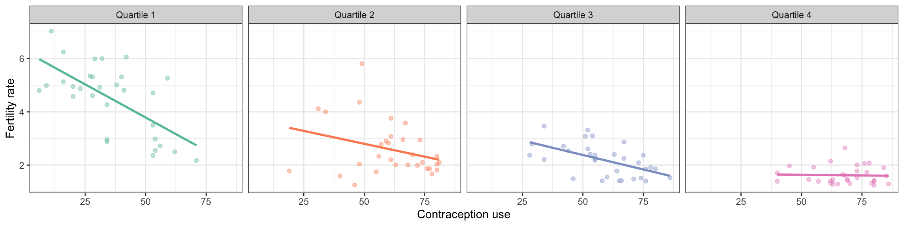
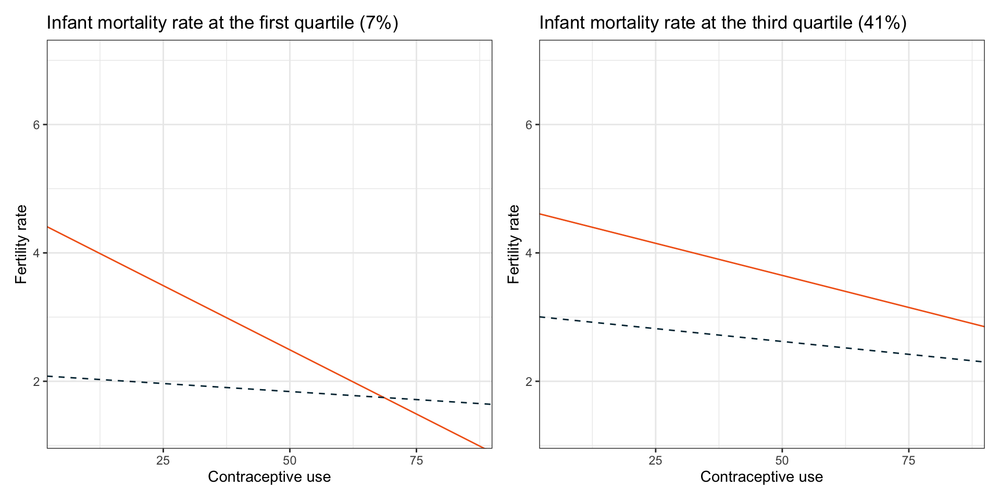

# More Interaction Effects {#interaction-02}


In this chapter, you will continue to learn about how to include and interpret interaction effects in the regression model. Here we will emphasize interactions between two continuous predictors. To do so, we will use the [fertility.csv](https://raw.githubusercontent.com/zief0002/modeling/master/data/fertility.csv) data to examine predictors of fertility rates; see the [data codebook](https://zief0002.github.io/epsy-8251/codebooks/fertility.html)). In particular we will evaluate whether the effect of contraception on fertility rates is a function of females' education level.

To begin, we will load several libraries and import the data into an object called `fert`.


```r
# Load libraries
library(broom)
library(corrr)
library(educate)
library(ggridges)
library(patchwork)
library(tidyverse)

# Read in data
fert = read_csv(file = "https://raw.githubusercontent.com/zief0002/modeling/master/data/fertility.csv")
head(fert)
```

```
# A tibble: 6 × 8
  country      region            ferti…¹ educ_…² infan…³ contr…⁴ gni_c…⁵ high_…⁶
  <chr>        <chr>               <dbl>   <dbl>   <dbl>   <dbl> <chr>     <dbl>
1 Albania      Europe and Centr…    1.49     9.1    15        46 Upper/…       1
2 Algeria      Middle East and …    2.78     5.9    17.2      57 Upper/…       1
3 Armenia      Europe and Centr…    1.39    10.8    14.7      57 Upper/…       1
4 Austria      Europe and Centr…    1.42     8.9     3.3      66 Upper         1
5 Azerbaijan   Europe and Centr…    1.92    10.5    30.8      55 Upper/…       1
6 Bahamas, The Latin America an…    1.97    11.1    13.9      45 Upper         1
# … with abbreviated variable names ¹​fertility_rate, ²​educ_female,
#   ³​infant_mortality, ⁴​contraceptive, ⁵​gni_class, ⁶​high_gni
```

<br />


## Data Exploration

To begin, as always, we would typically plot the marginal distributions of fertility rate and any predictors. Since you have already done this for Assignment 05, we will skip this exploration here. Ideally, we would only include an interaction effect in the model if there is support for this in the theoretical/substantive literature. However, barring this support, we might explore the sample data for empirical evidence of the interaction (generally via plots of the data). Exploring an interaction effect between two quantitative variables poses some unique challenges. 

To understand those challenges consider how we explored the interaction between sex and boundary-spanning work on guilt in a previous set of notes. We created a separate scatterplot of the effect of boundary-spanning work on guilt for males and females, and evaluated whether the fitted line for males and females were parallel. In other words, we need to examine the relationship between *X1* and *Y* for different levels of *X2*.

In this chapter, we are evaluating whether there is an interaction between contraception use and female education level on fertility rates. As such, we need to examine the effect of contraception use on fertility rates at different levels of female education. But, since female education is continuous, there are a lot of levels in the data! Rather than look at all of these levels, we generally choose a small number of levels of female education. Another challenge is that in continuous variables, there are typically very few observations at a specific value of that variable, so instead of selecting specific values, we typically cut the variable into distinct ranges of values.

Here we empirically identify distinct ranges for female education by examining the `summary()` output associated with that variable.


```r
fert %>%
  select(educ_female) %>%
  summary()
```

```
  educ_female    
 Min.   : 0.600  
 1st Qu.: 4.800  
 Median : 8.000  
 Mean   : 7.494  
 3rd Qu.:10.250  
 Max.   :13.000  
```

Based on the quartiles, we might choose four distinct ranges of female education:

- Female education level $< 4.8$
- $4.8 \leq$ Female education level $< 8$
- $8 \leq$ Female education level $< 10.25$
- $10.25 \leq$ Female education level

:::protip
Note that you will want to use the entire range of data to explore effects, otherwise, you might see a spurious relationship. Also, and this is VERY IMPORTANT, _**This discretizing is ONLY carried out to create the plot. When we fit the actual interaction in the regression model, we use the continuous predictor.**_
:::

There are several R functions that can be employed to discretize a continuous variable. We will use the `case_when()` function from **dplyr** (or **tidyverse**) to create a new variable that has four different categories, one for each distinct range. (Read more about using `case_when()` [here](https://dplyr.tidyverse.org/reference/case_when.html).) 


```r
# Discretize female education level
fert = fert %>%
  mutate(
    female_educ_discrete = case_when(
      educ_female < 4.8 ~ "Quartile 1",
      educ_female >= 4.8 & educ_female < 8 ~ "Quartile 2",
      educ_female >= 8 & educ_female < 10.25 ~ "Quartile 3",
      educ_female >= 10.25 ~ "Quartile 4"
      )
  )

# View data
head(fert)
```

```
# A tibble: 6 × 9
  country      region    ferti…¹ educ_…² infan…³ contr…⁴ gni_c…⁵ high_…⁶ femal…⁷
  <chr>        <chr>       <dbl>   <dbl>   <dbl>   <dbl> <chr>     <dbl> <chr>  
1 Albania      Europe a…    1.49     9.1    15        46 Upper/…       1 Quarti…
2 Algeria      Middle E…    2.78     5.9    17.2      57 Upper/…       1 Quarti…
3 Armenia      Europe a…    1.39    10.8    14.7      57 Upper/…       1 Quarti…
4 Austria      Europe a…    1.42     8.9     3.3      66 Upper         1 Quarti…
5 Azerbaijan   Europe a…    1.92    10.5    30.8      55 Upper/…       1 Quarti…
6 Bahamas, The Latin Am…    1.97    11.1    13.9      45 Upper         1 Quarti…
# … with abbreviated variable names ¹​fertility_rate, ²​educ_female,
#   ³​infant_mortality, ⁴​contraceptive, ⁵​gni_class, ⁶​high_gni,
#   ⁷​female_educ_discrete
```

Now we have discretized female education level, we can use our new discretized variable to examine the potential interaction with contraception use.


```r
ggplot(data = fert, aes(x = contraceptive, y = fertility_rate, color = female_educ_discrete)) +
  geom_point(alpha = 0.4) +
  geom_smooth(method = "lm", se = FALSE) +
	theme_bw() +
	xlab("Contraception use") +
	ylab("Fertility rate") +
  scale_color_brewer(palette = "Set2") +
  facet_wrap(~female_educ_discrete, nrow = 1) +
  guides(color = FALSE)
```

<div class="figure" style="text-align: center">

<p class="caption">(\#fig:unnamed-chunk-5)Scatterplot displaying the relationship between contraception use and fertility rate conditioned on female education level. RIGHT: Density plot of standardized amount of boundary-spanning work conditioned on gender.</p>
</div>

The empirical evidence is consistent with there being an interaction effect between contraception use and female education level on fertility rate *in the sample*; the effect of contraception use on fertility rate differs depending on the level of female education. It looks like the absolute magnitude of the effect of contraception use on fertility rate decreases for higher levels of female education. 

<br />


## Fit the Interaction Model

To fit the interaction model, use the constituent main effects and the interaction term to predict fertility rates. VERY IMPORTANT---Use the original quantitative female education level predictor, not the discretized variable in the model. We will also use the colon (`:`) notation to include the interaction term in the model. The colon implicitly creates the product term and includes it in the model (without having to initially create a product term).


```r
# Fit model
lm.a = lm(fertility_rate ~ 1 + educ_female + contraceptive + educ_female:contraceptive, data = fert)

# Model-level output
glance(lm.a)
```

```
# A tibble: 1 × 12
  r.squared adj.r.squa…¹ sigma stati…²  p.value    df logLik   AIC   BIC devia…³
      <dbl>        <dbl> <dbl>   <dbl>    <dbl> <dbl>  <dbl> <dbl> <dbl>   <dbl>
1     0.709        0.701 0.758    97.2 5.59e-32     3  -139.  289.  303.    68.9
# … with 2 more variables: df.residual <int>, nobs <int>, and abbreviated
#   variable names ¹​adj.r.squared, ²​statistic, ³​deviance
# ℹ Use `colnames()` to see all variable names
```

```r
# Coefficient-level output
tidy(lm.a)
```

```
# A tibble: 4 × 5
  term                      estimate std.error statistic  p.value
  <chr>                        <dbl>     <dbl>     <dbl>    <dbl>
1 (Intercept)                6.84      0.354       19.3  1.27e-38
2 educ_female               -0.408     0.0580      -7.04 1.29e-10
3 contraceptive             -0.0479    0.00768     -6.23 7.16e- 9
4 educ_female:contraceptive  0.00350   0.00100      3.50 6.63e- 4
```

Model A explains 70.9% of the variation in fertility rates which is not very consistent with the null hypothesis that the model explains no variation; $F(3,120)=97.23$, $p<.001$.

To examine whether there is an interaction effect in  the population, we evaluate the evidence from the coefficient-level output. The *p*-value associated with the interaction term ($p=.0007$) suggests that the empirical evidence is inconsistent with the hypothesis of no interaction effect. We do believe that there is an interaction between contraceptive use and female level of education. Because the interaction effect is statistically relevant, we do not interpret any of the constituent main-effects in the model.

<br />


### Plot of the Interaction Model

To further understand the nature of the interaction, we will create a plot of the effect of contraception use on fertility rates for different levels of female education. (Or, you could create a plot of the effect of female education level on fertility rates for different values of contraception use.) Here we will choose female education values of 5, 8, and 10 (the nearest integer values to the 25th, 50th, and 75th percentile values) to create the plot. First we will substitute these values into the fitted equation to find the partial equation for each selected female education level:

$$
\hat{\mathrm{Fertility~rate}_i} = 6.84 - 0.41(\mathrm{Education~level}_i) - 0.05(\mathrm{Contraceptive~use}_i) + 0.004(\mathrm{Contraceptive~use}_i)(\mathrm{Education~level}_i)
$$
<br />


#### Female education level of 5

$$
\begin{split}
\hat{\mathrm{Fertility~rate}_i} &= 6.84 - 0.41(5) - 0.05(\mathrm{Contraceptive~use}_i) + 0.004(5)(\mathrm{Contraceptive~use}_i)\\
&= 6.84 - 2.05 - 0.05(\mathrm{Contraceptive~use}_i) + 0.02(\mathrm{Contraceptive~use}_i) \\
&= 4.79 - 0.03(\mathrm{Contraceptive~use}_i)
\end{split}
$$

<br />


#### Female education level of 8

$$
\begin{split}
\hat{\mathrm{Fertility~rate}_i} &= 6.84 - 0.41(8) - 0.05(\mathrm{Contraceptive~use}_i) + 0.004(8)(\mathrm{Contraceptive~use}_i)\\
&= 6.84 - 3.28 - 0.05(\mathrm{Contraceptive~use}_i) + 0.032(\mathrm{Contraceptive~use}_i) \\
&= 3.56 - 0.018(\mathrm{Contraceptive~use}_i)
\end{split}
$$

<br />


#### Female education level of 10

$$
\begin{split}
\hat{\mathrm{Fertility~rate}_i} &= 6.84 - 0.41(10) - 0.05(\mathrm{Contraceptive~use}_i) + 0.004(10)(\mathrm{Contraceptive~use}_i)\\
&= 6.84 - 4.1 - 0.05(\mathrm{Contraceptive~use}_i) + 0.04(\mathrm{Contraceptive~use}_i) \\
&= 2.74 - 0.01(\mathrm{Contraceptive~use}_i)
\end{split}
$$

Now we can create out plot of fertility rates versus contraception use and add the three partial regression lines.


```r
# Plot the fitted model
ggplot(data = fert, aes(x = contraceptive, y = fertility_rate)) +
  geom_point(alpha = 0) +
  geom_abline(intercept = 4.79, slope = -0.03, color = "#022f40", linetype = "dotted") +
  geom_abline(intercept = 3.56, slope = -0.018, color = "#f26419", linetype = "dashed") +
  geom_abline(intercept = 2.74, slope = -0.01, color = "#758e4f", linetype = "solid") +
  theme_bw() +
  xlab("Contraceptive use") +
  ylab("Fertility rate")
```

<div class="figure" style="text-align: center">

<p class="caption">(\#fig:unnamed-chunk-7)Plot of fertility rate as a function of contraceptive use and female education level. Partial regression lines are displayed for female education levels of 5th grade (blue, dotted line), 8th grade (orange, dashed line) and 10th grade (green, solid line).</p>
</div>

Based on the plot, we can see there is an *ordinal interaction* between contraceptive use and female education level (the lines do not cross in our plot). The effect of contraceptive use on fertility rate varies by level of female education. The largest effect of contraceptive use on fertility rate (highest absolute slope) is for countries that have the lowest female education level. This effect diminishes for countries with higher levels of female education (the magnitude of the slopes get smaller).

Remember that every interaction effect has two interpretations. We can also focus on the the effect of female education level. In our data, the effect of female education level on fertility rate varies for different levels of contraceptive use. For countries with low rates of contraceptive use, there are large differences between the predicted average fertility rates by female education level (the distance between the lines is large). These differences diminish for countries with higher levels of contraceptive use.

<br />


## Interpreting the Individual Effects from the tidy() Output

In practice, it is enough to say there is an interaction, and to use the plot of the results to interpret the nature of the interaction effects rather than to interpret the actual coefficient values estimated by the `lm()` function. This being said, in simple models, we can actually interpret the coefficients more directly. To do this, write out the fitted equations for countries that differ in female education level by 1 year. We will write the fitted equations for countries that have a female education level of 0 years and those with a female education level of 1 year. (Do the substitution yourself to verify these equations.)

$$
\begin{split}
\mathbf{0~years:~}\hat{\mathrm{Fertility~rate}_i} &= 6.84 - 0.048(\mathrm{Contraceptive~use}_i) \\
\mathbf{1~year:~}\hat{\mathrm{Fertility~rate}_i} &= \left[6.84 -0.408 \right] + \left[ -0.0479 + 0.00350 \right](\mathrm{Contraceptive~use}_i)\\
\end{split}
$$


- The intercept ($\hat{\beta_0}=6.84$) is the average fertility rate for countries with a female education level of 0 years and contraception use of 0. (extrapolation).
- The coefficient associated with contraceptive use ($\hat{\beta_1}=-0.048$) is the effect of contraceptive use on fertility rate for countries with a female education level of 0 years.
- The coefficient associated with female education ($\hat{\beta_2}=-0.408$) is the difference in average fertility rates between countries with contraceptive use = 0 and countries with contraceptive use = 1. Alternatively, it is the difference in intercepts between countries whose female education level differs by one year.
- The coefficient associated with the interaction term ($\hat{\beta_3}=0.00350$) is the difference in slopes (effect of contraceptive use on fertility rate) between countries whose female education level differs by one year.

It cannot be iterated enough that although we can interpret the coefficients directly, in practice, the plot of the interaction model is much more informative and far less complicated for readers to understand.

<br />


## Adding Covariates

Is there an interaction between contraception use and female education level on fertility rates after we control for differences in infant mortality rate?


```r
# Fit model
lm.b = lm(fertility_rate ~ 1 + educ_female + contraceptive + infant_mortality + educ_female:contraceptive, data = fert)

# Model-level output
glance(lm.b)
```

```
# A tibble: 1 × 12
  r.squared adj.r.squa…¹ sigma stati…²  p.value    df logLik   AIC   BIC devia…³
      <dbl>        <dbl> <dbl>   <dbl>    <dbl> <dbl>  <dbl> <dbl> <dbl>   <dbl>
1     0.748        0.739 0.708    88.2 1.18e-34     4  -131.  273.  290.    59.6
# … with 2 more variables: df.residual <int>, nobs <int>, and abbreviated
#   variable names ¹​adj.r.squared, ²​statistic, ³​deviance
# ℹ Use `colnames()` to see all variable names
```

```r
# Coefficient-level output
tidy(lm.b)
```

```
# A tibble: 5 × 5
  term                      estimate std.error statistic  p.value
  <chr>                        <dbl>     <dbl>     <dbl>    <dbl>
1 (Intercept)                4.82     0.574         8.41 1.05e-13
2 educ_female               -0.271    0.0629       -4.31 3.45e- 5
3 contraceptive             -0.0317   0.00811      -3.91 1.55e- 4
4 infant_mortality           0.0212   0.00494       4.30 3.55e- 5
5 educ_female:contraceptive  0.00246  0.000966      2.55 1.20e- 2
```

Model B explains 74.8% of the variation in fertility rates which is inconsistent with the null hypothesis that the model explains no variation; $F(4,119)=88.16$, $p<.001$.

To examine whether there is an interaction effect, after controlling for differences in infant mortality rates, we again evaluate the evidence from the coefficient-level output. Based on the *p*-value associated with the interaction term ($p=.012$), the empirical evidence is consistent with there being an interaction effect between contraceptive use and female level of education, after controlling for differences in countries' infant mortality rates. 

How would we interpret the effects in the model?

- **Female education level:** Since this effect is part of an interaction term, we would interpret the interaction, namely, controlling for differences in infant mortality rates, the effect of female education level on fertility rates depends on contraceptive use.
- **Contraceptive use:** Since this effect is part of an interaction term, we would only interpret the interaction, namely, controlling for differences in infant mortality rates, the effect of contraceptive use on fertility rates depends on female education level.
- **Infant mortality:** Since this is not part of any interaction term, we interpret this as we would any other effect included in a multiple regression model, namely, controlling for differences in female education level and contraceptive use, each one-percentage point difference in infant mortality rate is associated with a 0.02-unit difference in fertility rates, on average.


To better understand the nature of the effects, especially the interaction, we will plot the fitted model. We choose female education values of 5, and 10 (the nearest integer values to the 25th and 75th percentile values) to create my plot. We also choose infant mortality values of 7 and 41 (the nearest integer values to the 25th and 75th percentile values) to show the effect of infant mortality rate.

<br />


#### Female education level of 5; Infant mortality rate of 7

$$
\begin{split}
\hat{\mathrm{Fertility~rate}_i} &= 4.82 - 0.271(5) - 0.03(\mathrm{Contraceptive~use}_i) + 0.02(7) + 0.002(5)(\mathrm{Contraceptive~use}_i)\\
&= 3.61 - 0.02(\mathrm{Contraceptive~use}_i)
\end{split}
$$

<br />


#### Female education level of 5; Infant mortality rate of 41

$$
\begin{split}
\hat{\mathrm{Fertility~rate}_i} &= 4.82 - 0.271(5) - 0.03(\mathrm{Contraceptive~use}_i) + 0.02(41) + 0.002(5)(\mathrm{Contraceptive~use}_i)\\
&= 4.29 - 0.02(\mathrm{Contraceptive~use}_i)
\end{split}
$$

<br />


#### Female education level of 10; Infant mortality rate of 7

$$
\begin{split}
\hat{\mathrm{Fertility~rate}_i} &= 4.82 - 0.271(10) - 0.03(\mathrm{Contraceptive~use}_i) + 0.02(7) + 0.002(10)(\mathrm{Contraceptive~use}_i)\\
&= 2.25 - 0.01(\mathrm{Contraceptive~use}_i)
\end{split}
$$

<br />


#### Female education level of 10; Infant mortality rate of 41

$$
\begin{split}
\hat{\mathrm{Fertility~rate}_i} &= 4.82 - 0.271(10) - 0.03(\mathrm{Contraceptive~use}_i) + 0.02(41) + 0.002(10)(\mathrm{Contraceptive~use}_i)\\
&= 2.93 - 0.01(\mathrm{Contraceptive~use}_i)
\end{split}
$$

Now we can create out plot of fertility rates versus contraception use and add the four partial regression lines.


```r
# Plot the fitted model (infant mortality rate = 7)
p1 = ggplot(data = fert, aes(x = contraceptive, y = fertility_rate)) +
  geom_point(alpha = 0) +
  geom_abline(intercept = 3.61, slope = -0.02, color = "#f26419", linetype = "solid") +
  geom_abline(intercept = 2.25, slope = -0.01, color = "#022f40", linetype = "dashed") +
  theme_bw() +
  xlab("Contraceptive use") +
  ylab("Fertility rate") +
  ggtitle("Infant mortality rate at the first quartile (7%)")

# Plot the fitted model (infant mortality rate = 41)
p2 = ggplot(data = fert, aes(x = contraceptive, y = fertility_rate)) +
  geom_point(alpha = 0) +
  geom_abline(intercept = 4.29, slope = -0.02, color = "#f26419", linetype = "solid") +
  geom_abline(intercept = 2.93, slope = -0.01, color = "#022f40", linetype = "dashed") +
  theme_bw() +
  xlab("Contraceptive use") +
  ylab("Fertility rate") +
  ggtitle("Infant mortality rate at the third quartile (41%)")

# Layout side-by-side plot
p1 | p2
```

<div class="figure" style="text-align: center">

<p class="caption">(\#fig:unnamed-chunk-9)Plot of fertility rate as a function of contraceptive use, female education level, and infant mortality rate. Partial regression lines are displayed for female education levels of 5th grade (orange, solid line), 8th grade (blue, dashed line) for countries with infant mortality rates at the first (7%) and third (41%) quartile values.</p>
</div>

<br />


## Higher Order Interactions

Interactions between two predictors (e.g., female education level and contraceptive use) are referred to as *first order* interactions. In the previous section, the model we fitted included a main-effect of infant mortality rate and a first order interaction between female education level and contraceptive use. The main-effect of infant mortality rate in this model suggested that the first order interaction between female education level and contraceptive use was THE SAME for every level of infant mortality rate.

We could also fit a model that posits that the first order interaction between female education level and contraceptive use IS DIFFERENT for different levels of infant mortality rate. This is technically an interaction between infant mortality rate and the first order interaction between female education level and contraceptive use. It is an interaction of an interaction. This is called a *second order* interaction.

To fit such a model, we would need to include the second order interaction between infant mortality rate, female education level and contraceptive use; the product of the three main effects. Since we are including an interaction, we need to include all three constituent main effects AND since it is a higher order interaction, we need to include all constituent lower order interactions; in this case all constituent first order interactions. As such the predictors would include:


- **Main-Effects:** 
  + `educ_female`
  + `contraceptive`
  + `infant_mortality`
- **First Order Interactions:** 
  + `educ_female:contraceptive`
  + `educ_female:infant_mortality`
  + `contraceptive:infant_mortality`
- **Second Order Interaction:** 
  + `educ_female:contraceptive:infant_mortality`

We fit the model below.


```r
# Fit model
lm.c = lm(fertility_rate ~ 1 + educ_female + contraceptive + infant_mortality + 
            educ_female:contraceptive + infant_mortality:contraceptive + educ_female:infant_mortality +
            educ_female:contraceptive:infant_mortality, data = fert)

# Coefficient-level output
tidy(lm.c)
```

```
# A tibble: 8 × 5
  term                                        estimate std.er…¹ stati…²  p.value
  <chr>                                          <dbl>    <dbl>   <dbl>    <dbl>
1 (Intercept)                                 7.02      1.02e+0    6.86 3.52e-10
2 educ_female                                -0.512     1.24e-1   -4.14 6.51e- 5
3 contraceptive                              -0.0754    1.68e-2   -4.47 1.80e- 5
4 infant_mortality                           -0.0182    1.38e-2   -1.32 1.90e- 1
5 educ_female:contraceptive                   0.00706   1.85e-3    3.81 2.21e- 4
6 contraceptive:infant_mortality              0.000962  3.25e-4    2.96 3.74e- 3
7 educ_female:infant_mortality                0.00455   2.85e-3    1.59 1.14e- 1
8 educ_female:contraceptive:infant_mortality -0.000104  5.16e-5   -2.01 4.69e- 2
# … with abbreviated variable names ¹​std.error, ²​statistic
```

The fitted equation is:

$$
\begin{split}
\hat{\mathrm{Fertility~rate}_i} &= 7.02 - 0.512(\mathrm{Female~education}_i) - 0.08(\mathrm{Contraceptive~use}_i) - 0.02(\mathrm{Infant~mortality}_i) + \\
& 0.007(\mathrm{Female~education}_i)(\mathrm{Contraceptive~use}_i) + 0.001(\mathrm{Contraceptive~use}_i)(\mathrm{Infant~mortality}_i) + \\
& 0.005(\mathrm{Female~education}_i)(\mathrm{Infant~mortality}_i) \\
&- 0.0001(\mathrm{Female~education}_i)(\mathrm{Contraceptive~use}_i)(\mathrm{Infant~mortality}_i)
\end{split}
$$
The *p*-value associated with the second order interaction term ($p=.0469$) suggests that there is a second order interaction effect between female education level, contraceptive use, and infant mortality rate on fertility rates. To interpret this, plot the model results. Again, pick values for female education level and infant mortality rate, substitute them into the fitted equation, and reduce it. I again used 5 and 10 for female education level and 7 and 41 for infant mortality rate. (Note: Algebra not shown.)


```r
# Plot the fitted model (infant mortality rate = 7)
p1 = ggplot(data = fert, aes(x = contraceptive, y = fertility_rate)) +
  geom_point(alpha = 0) +
  geom_abline(intercept = 4.49, slope = -0.04, color = "#f26419", linetype = "solid") +
  geom_abline(intercept = 2.09, slope = -0.005, color = "#022f40", linetype = "dashed") +
  theme_bw() +
  xlab("Contraceptive use") +
  ylab("Fertility rate") +
  ggtitle("Infant mortality rate at the first quartile (7%)")

# Plot the fitted model (infant mortality rate = 41)
p2 = ggplot(data = fert, aes(x = contraceptive, y = fertility_rate)) +
  geom_point(alpha = 0) +
  geom_abline(intercept = 4.65, slope = -0.02, color = "#f26419", linetype = "solid") +
  geom_abline(intercept = 3.02, slope = -0.008, color = "#022f40", linetype = "dashed") +
  theme_bw() +
  xlab("Contraceptive use") +
  ylab("Fertility rate") +
  ggtitle("Infant mortality rate at the third quartile (41%)")

# Layout side-by-side plot
p1 | p2
```

<div class="figure" style="text-align: center">

<p class="caption">(\#fig:unnamed-chunk-12)Plot of fertility rate as a function of contraceptive use, female education level, and infant mortality rate. Partial regression lines are displayed for female education levels of 5th grade (orange, solid line), 8th grade (blue, dashed line) for countries with infant mortality rates at the first (7%) and third (41%) quartile values.</p>
</div>

- The plots show that the interaction between contraceptive use and female education level on fertility rates DIFFERS by infant mortality rate.
- This also suggests that the interaction between contraceptive use and infant mortality rate on fertility rates DIFFERS by level of female education.
- Finally, it also implies that the interaction between female education level and infant mortality rate on fertility rates DIFFERS by level of contraceptive use.

<br />


## Some Advice for Fitting Interaction Models

In general, only fit interaction terms that include focal predictors that are germane to your research question. Do not fit interaction terms that are composed of all control predictors. This has the implication that if you do not have a focal predictor (i.e., the analysis is purely exploratory) you should probably not fit interaction terms.

A second piece of advice is that unless there is specific theoretical reason to fit higher order interactions with your focal predictors, avoid them. This also is good advice for first order interaction terms as well. This is because adding higher-order interactions tends to overfit the model to the sample data. Subsequently, these interactions do not tend to hold up when fitted on future data in future analysis; the model is too specific to the data it was fitted on and does not generalize.


